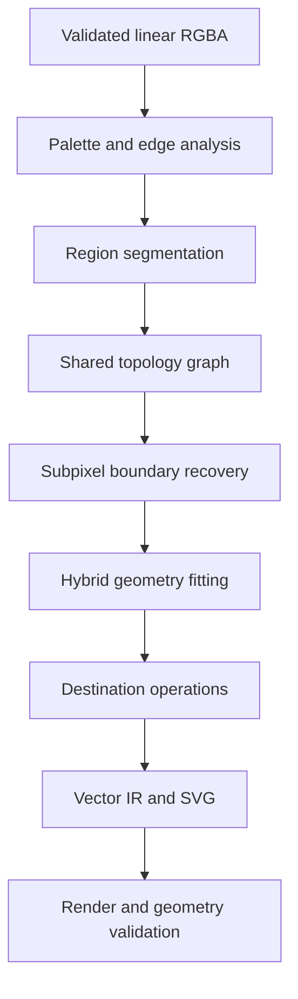
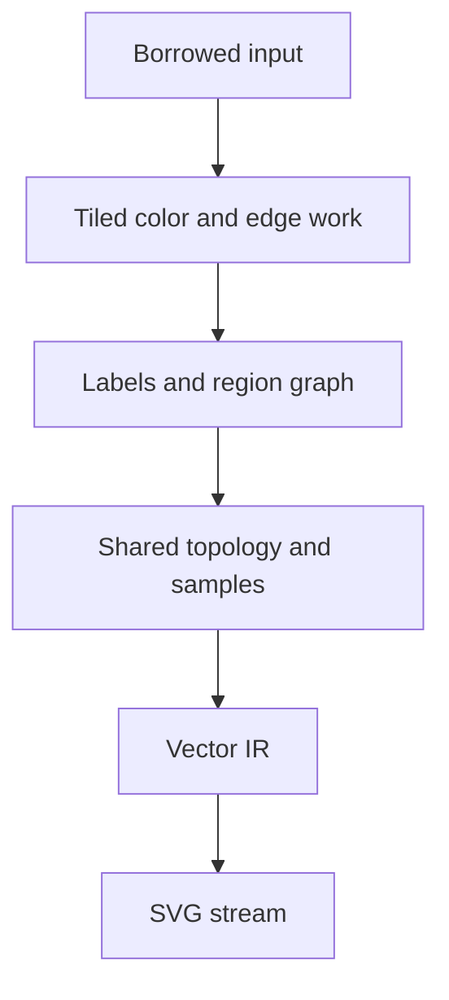

# Palette Tracer Engine (PTE)

## Normative Engineering Specification for a Rust Bitmap-to-SVG Engine

**Document status:** First reference draft  
**Specification version:** 0.1.0  
**Date:** 2026-08-10  
**Working product name:** Palette Tracer Engine, abbreviated **PTE**  
**Target repository:** `csabourin/Palette-Tracer` or a successor Rust workspace  
**Intended readers:** coding agents, maintainers, algorithm engineers, API integrators, and release reviewers  
**Proposed engine license:** `MIT OR Apache-2.0`  

---

## 0. How to use this specification

This document is the implementation contract for a second-generation raster-to-vector engine. It is not a product pitch and it is not permission to approximate difficult stages with convenient substitutes. A coding agent shall use it to decide:

- what must be implemented;
- what may be reused from compatible open-source work;
- which algorithms and representations are acceptable;
- which shortcuts are explicitly forbidden;
- what evidence is required before a feature may be called complete;
- how native Rust, the CLI, and WebAssembly must remain behaviorally aligned.

The current Palette-Tracer project remains valuable prior art for exact palettes, color reaches, destination profiles, deterministic behavior, and output intent. PTE preserves those strengths while replacing the main architectural limitation of mask-at-a-time tracing with a shared, label-aware topology and a hybrid fill/stroke/gradient representation.

### 0.1 Normative language

The key words **MUST**, **MUST NOT**, **REQUIRED**, **SHALL**, **SHALL NOT**, **SHOULD**, **SHOULD NOT**, **RECOMMENDED**, **MAY**, and **OPTIONAL** are normative.

Every normative requirement has a stable identifier such as `PTE-TOPO-004`. Implementations, issues, tests, and pull requests SHOULD cite these identifiers.

### 0.2 Evidence rule

No requirement is complete because code exists. Completion requires all of the following:

1. the implementation;
2. tests at the appropriate levels;
3. measured behavior on the reference corpus;
4. documentation of intentional limitations;
5. no regression in deterministic output, topology, memory, or supported targets.

Words such as “fast,” “seam-free,” “exact,” “uniform,” and “production-ready” MUST NOT appear in release claims without a named metric, corpus, threshold, and reproducible command.

### 0.3 Requirement families

| Prefix | Area |
|---|---|
| `PTE-GOAL` | Product goals |
| `PTE-PROFILE` | Profile behavior and configuration |
| `PTE-BASE` | Baseline and comparative research |
| `PTE-ARCH` | Architecture and crate boundaries |
| `PTE-API` | Rust, CLI, C, and WebAssembly APIs |
| `PTE-COLOR` | Color management, palettes, and assignment |
| `PTE-SEG` | Segmentation and region merging |
| `PTE-TOPO` | Shared topology and raster ambiguity |
| `PTE-AA` | Antialias and subpixel reconstruction |
| `PTE-GEO` | Curves, corners, primitives, and regularization |
| `PTE-STROKE` | Centerlines, widths, caps, and joins |
| `PTE-GRAD` | Gradient reconstruction |
| `PTE-FAB` | Vinyl, paper, laser, and screen-print geometry |
| `PTE-SVG` | SVG representation and serialization |
| `PTE-PERF` | Time, memory, streaming, and parallelism |
| `PTE-DET` | Determinism and reproducibility |
| `PTE-SEC` | Robustness and security |
| `PTE-TEST` | Tests, metrics, corpora, and release gates |
| `PTE-LIC` | Licensing and provenance |
| `PTE-NO` | Explicitly forbidden shortcuts |

---

## 1. Executive decisions

The following decisions define PTE. Reversing one requires an Architecture Decision Record (ADR), compatibility analysis, and approval by maintainers.

1. **One raster partition, one shared topology.** Neighboring filled regions share a single geometric boundary. PTE does not independently trace one binary mask per color for cutout, mosaic, coloring-book, or other seam-sensitive output.
2. **Art direction is a first-class constraint.** Exact palettes, pinned colors, per-color reaches, background intent, layer role, and destination profile affect segmentation and geometry rather than recoloring a completed trace.
3. **Hybrid vector representation.** The engine selects among filled regions, stroked centerlines, recognized primitives, solid fills, standard SVG gradients, and—in explicitly non-portable modes—advanced shading representations.
4. **Rust core, portable by construction.** The core is free of filesystem, network, wall-clock, UI, and process assumptions. It compiles for native targets and `wasm32-unknown-unknown`.
5. **Editability is part of quality.** Fidelity alone is insufficient. Topology, node count, semantic grouping, shared geometry, palette intent, and fabrication validity are measured outputs.
6. **Linear or near-linear memory.** No normal pipeline stage allocates a table proportional to `pixel_count × palette_size`, `pixel_count × scan_count`, or `pixel_count × candidate_curve_count`.
7. **Deterministic by default.** Identical input bytes, decoded pixels, configuration, engine version, and target feature set produce semantically identical output regardless of thread count or tile schedule.
8. **Profiles expose intent, not hidden algorithms.** A profile chooses documented policies and defaults. Every effective setting is serializable and inspectable.
9. **Permissive engine boundary.** The proposed core and first-party adapters use `MIT OR Apache-2.0`. GPL implementations may be benchmark references or external process adapters, but their code is not copied into or linked with the permissive core.
10. **VTracer is a baseline, not the product definition.** VTracer 1.0 alpha already offers a Rust framework, WASM packaging, fixed palettes, watershed segmentation, and shared-boundary cutout. Phase 0 must benchmark it and assess compatible reuse component by component. PTE must retain its own IR, contracts, profiles, validation, and differentiating algorithms.

---

## 2. Product scope

### 2.1 Primary goals

`PTE-GOAL-001` PTE MUST convert decoded raster images to compact, valid, editable SVG with behavior suited to the declared destination.

`PTE-GOAL-002` PTE MUST support both user-supplied fixed palettes and deterministic automatic palettes.

`PTE-GOAL-003` PTE MUST preserve shared borders without gaps, overlaps, double seams, or independently drifting Bézier curves in exclusive-fill profiles.

`PTE-GOAL-004` PTE MUST reconstruct corners and smooth curves at subpixel positions when the raster contains usable antialias coverage evidence.

`PTE-GOAL-005` PTE MUST distinguish stroke-like content from filled silhouettes and preserve statistically stable line width when a stroke representation is appropriate.

`PTE-GOAL-006` PTE MUST expose destination-aware output for logos, flat illustrations, vinyl/paper cutting, laser work, coloring pages, lettering, screen printing, line art, gradients, and pixel art.

`PTE-GOAL-007` PTE MUST be usable as:

- a pure Rust library;
- a command-line program;
- a WebAssembly module for browser workers and JavaScript runtimes;
- optionally, a stable C ABI built in a separate crate.

`PTE-GOAL-008` PTE MUST provide structured diagnostics and a machine-readable report explaining important decisions, confidence, warnings, effective settings, and measured output properties.

### 2.2 Non-goals

PTE is not required to:

- identify a font or replace raster lettering with live text;
- perform OCR;
- semantically understand arbitrary photographs;
- reproduce every photographic texture as editable SVG;
- emit G-code, HPGL, proprietary cutter commands, or laser power/speed instructions;
- define universal meanings for SVG colors in fabrication workflows;
- hide lossy decisions from the caller;
- guarantee identical serialized bytes across engine versions;
- use machine learning in the baseline engine;
- support SVG gradient meshes as a portable baseline feature.

### 2.3 Success dimensions

Quality is a vector, not a scalar:

\[
Q = (Q_{topology}, Q_{boundary}, Q_{color}, Q_{stroke}, Q_{edit}, Q_{fabrication}, Q_{runtime})
\]

A release MUST NOT collapse these axes into one score for acceptance. A composite score MAY rank experiments, but every hard safety or topology gate remains independent.

---

## 3. Output profiles

Every trace uses exactly one primary profile and MAY enable compatible modifiers. A profile is a versioned bundle of defaults; it is never an opaque code path.

| Profile ID | Intended output | Preferred representation | Non-negotiable properties |
|---|---|---|---|
| `logo` | Logos, marks, icons, signage | Shared fills, primitives, selective strokes | Few nodes, stable corners, exact palette, conservative regularization |
| `flat-illustration` | Cartoons, clip art, flat artwork | Shared filled faces | Seam-free adjacency, small-region intent, editable layers |
| `vinyl-cut` | Adhesive vinyl and paper cutters | Closed exclusive paths | No overlaps unless requested, minimum feature checks, winding and nesting validity |
| `laser` | Cut, score, and engrave preparation | Operation groups plus closed/open paths | Duplicate-line removal, physical units, operation naming, fabrication report |
| `coloring-book` | Printable outlines | Shared boundary strokes | Every visible interface drawn once, clean junctions, no doubled dark seams |
| `line-art` | Drawings, plans, ink strokes | Centerlines plus variable-width outlines | Width preservation, endpoint/cap inference, topological junctions |
| `lettering` | Raster type and hand lettering | Hybrid fills/strokes | Uniform stems where evidenced, stable counters, no font substitution |
| `screen-print` | Spot-color separations | Shared fills, underbase/traps | Exact inks, controllable choke/spread, minimum printable feature warnings |
| `gradient-illustration` | Modern shaded illustrations | Solid, linear, and radial SVG paint servers | Few editable gradients, no contour-band masquerade, portable fallback |
| `pixel-art` | Low-resolution pixel art | Connectivity-aware polygons/curves | Intentional diagonal topology, no generic antialias assumptions |
| `poster` | Stylized photos and complex art | Region fills, optional gradients | Explicitly lossy, bounded region count, honest fidelity/editability report |

### 3.1 Profile modifiers

Compatible modifiers include:

- `exact-palette`;
- `preserve-alpha`;
- `transparent-background`;
- `shared-mosaic`;
- `stacked-layers`;
- `recognize-primitives`;
- `prefer-strokes`;
- `physical-scale-known`;
- `allow-portable-gradients`;
- `allow-experimental-shading`;
- `strict-determinism`.

`PTE-PROFILE-001` Invalid combinations MUST return a typed configuration error. They MUST NOT silently choose an arbitrary winner.

`PTE-PROFILE-002` The trace report MUST include the fully expanded effective configuration, including defaults supplied by the profile version.

---

## 4. Open-source and research baseline

### 4.1 Landscape as of 2026-08-10

| System | Strengths relevant to PTE | Important gap or constraint | License implication |
|---|---|---|---|
| Potrace | Excellent binary-outline model: path decomposition, global optimal polygon, corner/curve classification, cubic fitting and curve optimization | Binary input; no shared multicolor topology, strokes, or gradients | Program is GPL; study paper and behavior, do not copy implementation into permissive core |
| AutoTrace | Color reduction, outline tracing, centerline mode, despeckling | Older C architecture; less suitable as a directly portable modern core | Program GPL-2+; library LGPL-2.1+; avoid linkage in the permissive WASM core |
| ImageTracerJS | Small browser-oriented color tracer, permissive/public-domain code base | Simpler topology and cleanup; region omission after tracing can create holes | Unlicense/public domain; ideas/code still require provenance review and tests |
| VTracer 1.0 alpha | Rust, CLI/library/WASM, fixed OKLab palette, hierarchical watershed, seam-free shared-boundary cutout, curve simplification, cached stages | Alpha API; PTE still needs richer art direction, antialias inversion, stroke model, lettering constraints, standard gradient reconstruction, fabrication semantics and stricter contracts | Current workspace declares `MIT OR Apache-2.0`; verify exact dependency and file licensing before reuse |
| Palette-Tracer (current) | Exact palettes, OKLCH reaches, deterministic constrained quantization, background and destination policies | Python memory cost; mask-at-a-time backend; shared geometry, centerlines, gradients and alpha reconstruction are deferred | Current project is GPL-3.0+; migrate concepts through a documented clean-room boundary if the new engine is separately permissive |

`PTE-BASE-001` Phase 0 MUST benchmark the current stable and 1.0-alpha VTracer lines, Potrace, AutoTrace, and ImageTracerJS on a licensed common corpus.

`PTE-BASE-002` PTE MUST NOT claim novelty for shared-boundary cutout, watershed segmentation, fixed palettes, Rust packaging, or WASM packaging alone.

`PTE-BASE-003` Reuse decisions MUST be made per component. Wrapping an existing tracer behind a new CLI does not satisfy this specification.

### 4.2 Research conclusions incorporated here

1. Color quantization is not segmentation. A small palette may still yield thousands of connected fragments and irregular boundaries.
2. Image vectorization is usefully modeled as alternating operations on a **dual region-adjacency graph** and a **primal shared-boundary graph**.
3. Antialiased edge pixels are mixture observations containing subpixel boundary information, not merely noise to blur or threshold away.
4. Line drawings need a topology-and-width model; outline tracing alone cannot reliably infer their intended strokes.
5. Gradient regions should be detected and reconstructed as continuous paint models, not approximated by many contour bands.
6. SVG 2 interoperable paint servers are primarily solid colors plus linear and radial gradients. More advanced shading requires an explicit portability policy.

---

## 5. System architecture

### 5.1 Workspace layout

The RECOMMENDED Cargo workspace is:

```text
palette-tracer/
├── Cargo.toml
├── crates/
│   ├── palette-tracer-core/       # Host-free orchestration, config, IR, reports
│   ├── palette-tracer-color/      # Color spaces, palettes, assignment, statistics
│   ├── palette-tracer-segment/    # Watershed, RAG, region merging, cleanup
│   ├── palette-tracer-topology/   # Label topology, DCEL/half-edge structures
│   ├── palette-tracer-geometry/   # Subpixel boundaries, fitting, primitives, strokes
│   ├── palette-tracer-gradients/  # Standard gradient detection and fitting
│   ├── palette-tracer-fabrication/# Offsets, traps, validation, operation ordering
│   ├── palette-tracer-svg/        # SVG IR lowering and deterministic serialization
│   ├── palette-tracer-codecs/     # Optional PNG/JPEG/WebP/etc. adapters
│   ├── palette-tracer-cli/        # Native command-line application
│   ├── palette-tracer-wasm/       # wasm-bindgen adapter
│   ├── palette-tracer-capi/       # Optional C ABI
│   └── palette-tracer-bench/      # Corpus runner and metrics
├── fixtures/
├── fuzz/
├── docs/
└── tools/
```

Fewer crates MAY be used initially, but dependency directions and host isolation MUST be preserved.

### 5.2 Dependency rules

`PTE-ARCH-001` `palette-tracer-core` MUST NOT depend on CLI parsing, DOM APIs, filesystem APIs, environment variables, process execution, a global allocator replacement, or a particular image codec.

`PTE-ARCH-002` Core tracing MUST accept a validated borrowed pixel view or an explicitly owned buffer. Hidden cloning at the API boundary is forbidden.

`PTE-ARCH-003` All algorithms needed by the baseline profiles MUST compile for `wasm32-unknown-unknown` without OS stubs.

`PTE-ARCH-004` Optional native acceleration MUST live behind capability flags and MUST have a deterministic scalar fallback.

`PTE-ARCH-005` Crate feature flags MUST be additive. Enabling a feature MUST NOT silently alter baseline output except for an explicitly named algorithm feature recorded in the report.

`PTE-ARCH-006` The core MUST return structured `VectorDocument` data. It MUST NOT use unvalidated SVG path strings as its internal geometry protocol.

`PTE-ARCH-007` Decoder errors, configuration errors, resource-limit errors, numerical failures, cancellation, and validation failures MUST be distinct error categories.

### 5.3 Pipeline



The normative stages are:

| Stage | Input | Output | May tile? | Global information required? |
|---|---|---|---|---|
| A. Validate and normalize | decoded pixels + metadata | canonical image view | Yes | dimensions, limits, color profile |
| B. Analyze | canonical pixels + intent | color stats, edge field, palette model | Yes | bounded histograms and reductions |
| C. Segment | analysis products | exclusive label map + region graph | Yes, with halos/merge | final graph reconciliation |
| D. Build topology | label map + region graph | shared primal graph/DCEL | Yes, with seam stitching | deterministic junction reconciliation |
| E. Refine boundaries | shared graph + source samples | subpixel shared polylines + confidence | Yes | local neighborhoods |
| F. Fit representation | graph + profiles | fills, strokes, primitives, gradients | Per graph component | profile-level constraints |
| G. Apply destination policy | vector IR | offsets, traps, operations, grouping | Per component | nesting/order |
| H. Serialize | validated vector IR | SVG + report | Streamable | definitions and stable IDs |
| I. Validate | SVG/IR + source | metrics and diagnostics | Yes | aggregate gates |

`PTE-ARCH-008` Each stage MUST expose a typed input/output contract and stage statistics. A stage MUST NOT reach backward through global mutable state.

`PTE-ARCH-009` Expensive reusable results—analysis, segmentation, topology—SHOULD be immutable session artifacts so parameter tuning can rerun later stages.

### 5.4 Operating modes

The engine defines three conformance levels:

| Level | Required capabilities |
|---|---|
| `core` | Fixed/automatic palette, flat regions, shared topology, cubic/line fitting, SVG, deterministic single-thread execution |
| `full` | All core features plus strokes, logo/lettering constraints, fabrication, standard gradients, reports and all primary profiles |
| `experimental` | Non-portable mesh/diffusion shading, novel optimizers, GPU or SIMD variants not yet proven equivalent |

Experimental output MUST be opt-in and MUST include a portability warning in the report.

---

## 6. Public data model and APIs

### 6.1 Pixel input

```rust
pub struct ImageView<'a> {
    pub width: u32,
    pub height: u32,
    pub stride_bytes: usize,
    pub format: PixelFormat,
    pub data: &'a [u8],
    pub color_encoding: ColorEncoding,
    pub alpha_mode: AlphaMode,
}

pub enum PixelFormat {
    Gray8,
    GrayAlpha8,
    Rgb8,
    Rgba8,
    Rgba16,
    RgbaF32,
}
```

`PTE-API-001` Construction MUST validate dimensions, stride, multiplication overflow, format alignment, and required byte length before algorithms read any pixel.

`PTE-API-002` Pixel-center coordinates are `(x + 0.5, y + 0.5)`. The image domain is `[0,width] × [0,height]`; SVG user coordinates initially use the same domain.

`PTE-API-003` Orientation metadata MUST be applied by a codec/host adapter or explicitly declared already applied. The core MUST NOT guess.

### 6.2 High-level Rust API

```rust
pub struct Engine {
    capabilities: Capabilities,
}

impl Engine {
    pub fn validate_config(&self, config: &TraceConfig)
        -> Result<EffectiveConfig, ConfigError>;

    pub fn analyze(
        &self,
        image: ImageView<'_>,
        config: &EffectiveConfig,
        control: &dyn TraceControl,
    ) -> Result<Analysis, TraceError>;

    pub fn segment(
        &self,
        analysis: &Analysis,
        config: &EffectiveConfig,
        control: &dyn TraceControl,
    ) -> Result<Segmentation, TraceError>;

    pub fn vectorize(
        &self,
        analysis: &Analysis,
        segmentation: &Segmentation,
        config: &EffectiveConfig,
        control: &dyn TraceControl,
    ) -> Result<TraceOutput, TraceError>;

    pub fn trace(
        &self,
        image: ImageView<'_>,
        config: &TraceConfig,
        control: &dyn TraceControl,
    ) -> Result<TraceOutput, TraceError>;
}
```

`PTE-API-004` Convenience APIs MAY accept encoded bytes, but MUST live outside the algorithmic core and MUST apply the same limits as raw-pixel APIs.

`PTE-API-005` `TraceOutput` MUST contain at least the typed vector document, expanded config, report, deterministic semantic digest, and engine/build metadata.

`PTE-API-006` Long operations MUST support cooperative cancellation and progress. Cancellation checks MUST occur at bounded work intervals, not merely between full-image stages.

```rust
pub trait TraceControl: Sync {
    fn is_cancelled(&self) -> bool;
    fn progress(&self, event: ProgressEvent);
}
```

Callbacks MUST NOT be invoked while an internal lock is held.

### 6.3 Configuration model

```rust
pub struct TraceConfig {
    pub schema_version: u32,
    pub profile: Profile,
    pub palette: PalettePolicy,
    pub color: ColorPolicy,
    pub segmentation: SegmentationPolicy,
    pub geometry: GeometryPolicy,
    pub strokes: StrokePolicy,
    pub gradients: GradientPolicy,
    pub fabrication: FabricationPolicy,
    pub output: OutputPolicy,
    pub resources: ResourceLimits,
    pub determinism: DeterminismPolicy,
}
```

`PTE-API-007` Config serialization MUST reject unknown enum values and invalid numeric ranges. A future schema MAY preserve unknown fields for round-tripping, but MUST NOT silently apply them.

`PTE-API-008` Floating-point values MUST reject NaN and infinity at deserialization.

`PTE-API-009` Every automatically chosen value that materially changes output MUST be recorded in `EffectiveConfig` and the report.

### 6.4 Vector intermediate representation

```rust
pub struct VectorDocument {
    pub viewport: Rect,
    pub physical_size: Option<PhysicalSize>,
    pub palette: Vec<Paint>,
    pub defs: Vec<Definition>,
    pub layers: Vec<Layer>,
    pub provenance: DocumentProvenance,
}

pub enum Element {
    FilledFace(FilledFace),
    Stroke(StrokePath),
    Primitive(Primitive),
    Group(Group),
}

pub enum PathSegment {
    Line { to: Point },
    Cubic { c1: Point, c2: Point, to: Point },
    Arc { radii: Vec2, rotation: f64, large: bool, sweep: bool, to: Point },
}

pub enum Paint {
    Solid(Color),
    LinearGradient(LinearGradient),
    RadialGradient(RadialGradient),
    Experimental(ExperimentalPaint),
}
```

The internal topology MUST be richer than the output tree:

```rust
pub struct SharedEdge {
    pub id: EdgeId,
    pub left_face: FaceId,
    pub right_face: FaceId,
    pub geometry: CurveChainId,
    pub confidence: BoundaryConfidence,
    pub flags: EdgeFlags,
}
```

Faces reference oriented shared edges. Reversing a face traversal reverses the same curve chain; it does not clone and independently refit it.

`PTE-API-010` IDs MUST be stable within a trace and assigned by a deterministic order derived from raster/topological position, not allocation order.

`PTE-API-011` Geometry MUST remain in at least `f64` during fitting and validation. Serialization MAY round coordinates only after error gates pass.

### 6.5 Reports and diagnostics

The report MUST include:

- input dimensions, pixel encoding and color-profile handling;
- effective profile and all expanded settings;
- timing and peak-memory measurements when the host can provide them;
- palette entries, pinned status, region counts, and reassignment counts;
- topology counts: faces, shared edges, junctions, components, holes;
- representation counts: paths, lines, cubics, arcs, primitives, strokes, gradients, stops;
- boundary, color and rerender metrics if validation was requested;
- fabrication warnings and repairs;
- every fallback, budget-triggered downgrade, and unsupported feature;
- engine version, feature set, target, algorithm versions, and semantic digest.

`PTE-API-012` Warnings MUST use stable machine-readable codes. Human prose alone is insufficient.

---

## 7. Color pipeline

### 7.1 Canonical color representation

`PTE-COLOR-001` Sampling, alpha reconstruction, resampling, and mixture fitting MUST operate in a declared linear-light RGB space.

`PTE-COLOR-002` Perceptual distance and clustering SHOULD use OKLab. OKLCH MAY be used for user-facing hue/chroma/lightness controls, with explicit neutral-hue handling.

`PTE-COLOR-003` The engine MUST distinguish:

- encoded RGB;
- linear RGB;
- premultiplied linear RGBA;
- perceptual OKLab/OKLCH;
- output CSS color notation.

These types SHOULD be distinct Rust newtypes so accidental mixing is a compile-time error.

For encoded sRGB channel `c_s ∈ [0,1]`, linearization is:

\[
c_l =
\begin{cases}
c_s / 12.92, & c_s \le 0.04045 \\
\left(\frac{c_s + 0.055}{1.055}\right)^{2.4}, & c_s > 0.04045
\end{cases}
\]

The inverse transform MUST only be applied at output/preview boundaries.

For linear sRGB `(r,g,b)`, the reference OKLab forward transform is:

\[
\begin{aligned}
l &= 0.4122214708r + 0.5363325363g + 0.0514459929b,\\
m &= 0.2119034982r + 0.6806995451g + 0.1073969566b,\\
s &= 0.0883024619r + 0.2817188376g + 0.6299787005b,\\
l'&=\sqrt[3]{l},\quad m'=\sqrt[3]{m},\quad s'=\sqrt[3]{s},\\
L &= 0.2104542553l' + 0.7936177850m' - 0.0040720468s',\\
a &= 1.9779984951l' - 2.4285922050m' + 0.4505937099s',\\
b_o &= 0.0259040371l' + 0.7827717662m' - 0.8086757660s'.
\end{aligned}
\]

The subscript in `b_o` distinguishes the OKLab opponent coordinate from the input blue channel. Then:

\[
C=\sqrt{a^2+b_o^2},\qquad h=\operatorname{atan2}(b_o,a).
\]

`PTE-COLOR-004` The implementation MUST test these constants against published reference vectors and document whether reported `ΔE_OK` uses the native OKLab `[0,1]`-scale convention or a multiplied display convention. Thresholds MUST include the convention.

### 7.2 ICC and source color policy

`PTE-COLOR-005` The default decoded-byte API assumes sRGB only when the caller or codec reports no embedded profile. The report MUST say when this assumption was made.

`PTE-COLOR-006` An adapter that supports ICC MUST transform source colors into a canonical working space before tracing. Profile conversion MUST be testable independently and MAY use a compatible pure-Rust library such as `moxcms` after dependency review.

`PTE-COLOR-007` Unsupported or malformed profiles MUST result in either a typed error under strict policy or an explicit warning plus documented fallback under permissive policy.

### 7.3 Alpha

Source-over compositing in premultiplied form is:

\[
\mathbf{c}_o = \mathbf{c}_s + \mathbf{c}_b(1-\alpha_s), \qquad
\alpha_o = \alpha_s + \alpha_b(1-\alpha_s)
\]

`PTE-COLOR-008` Fully transparent pixels MUST have no color influence. Changing RGB values where alpha is zero MUST leave semantic output unchanged.

`PTE-COLOR-009` Straight-alpha inputs MUST be converted with care around very small alpha. Unpremultiplication MUST use a documented epsilon and MUST NOT amplify arbitrary transparent RGB into palette evidence.

`PTE-COLOR-010` Background removal and alpha preservation are different operations and MUST have separate policies.

### 7.4 Fixed palette and color claims

Each palette entry has:

```rust
pub struct PaletteEntry {
    pub id: PaletteId,
    pub output: Color,
    pub anchor: Oklab,
    pub pinned: bool,
    pub reach: ColorReach,
    pub role: PaletteRole,
    pub priority: i16,
}
```

The current Palette-Tracer concept of a per-color reach is retained. One user-facing form is an anisotropic normalized distance in OKLCH:

\[
s_k(x)=
w_L\left(\frac{\Delta L}{r_{L,k}}\right)^2+
w_C\left(\frac{\Delta C}{r_{C,k}}\right)^2+
w_H\left(\frac{2\sqrt{C_x C_k}\sin(\Delta h/2)}{r_{H,k}}\right)^2
\]

where the circular hue difference is:

\[
\Delta h = \operatorname{atan2}(\sin(h_x-h_k),\cos(h_x-h_k)).
\]

Entry `k` claims pixel/region `x` when `s_k(x) ≤ 1`, subject to alpha and role policy.

`PTE-COLOR-011` Hue MUST be treated as powerless near neutral colors. When either chroma is below a configurable neutral threshold, the hue term MUST smoothly lose weight rather than applying an unstable angle.

`PTE-COLOR-012` If multiple entries claim a sample, the winner MUST be determined by normalized score, explicit priority, then stable palette ID. Array iteration order alone MUST NOT be the undocumented tie-break.

`PTE-COLOR-013` Distinct pinned palette IDs MUST remain distinct even if their output colors are numerically equal. This supports separate ink or fabrication roles.

`PTE-COLOR-014` Palette colors MUST participate during segmentation and antialias mixture analysis. Post-hoc recoloring of unconstrained geometry does not satisfy exact-palette mode.

### 7.5 Efficient assignment

For `N` pixels and `K` palette entries:

`PTE-COLOR-015` The baseline exact assignment MUST use `O(N)` label storage and bounded working memory independent of `N×K`. Acceptable methods include:

- scan one palette entry at a time while maintaining per-pixel best score and label;
- tile pixels and evaluate candidates into a bounded tile buffer;
- use conservative OKLab/OKLCH buckets to prune candidates, followed by exact scoring.

`PTE-COLOR-016` Candidate pruning MUST be conservative. It may reduce work but MUST NOT change the exact winner relative to the defined score unless an approximate mode is explicitly enabled and reported.

`PTE-COLOR-017` A cache for repeated RGB tuples MUST be bounded and deterministic. Hash-table eviction or iteration MUST NOT affect labels.

Recommended storage is structure-of-arrays with labels in `u8` when the complete internal label set is at most 255 and `u16` otherwise. Confidence MAY be quantized to `u8` after the computation that produces it.

### 7.6 Automatic palette

`PTE-COLOR-018` Automatic palette generation MUST be deterministic and weighted by pixel/region frequency after alpha policy.

`PTE-COLOR-019` Pinned colors never move. Automatic centers MAY be initialized by deterministic weighted farthest-point selection and refined by weighted Lloyd iterations in OKLab.

`PTE-COLOR-020` Empty clusters MUST be repaired by the deterministically worst represented eligible sample, with stable ties.

`PTE-COLOR-021` Automatic palette generation is an initialization/appearance model. It MUST NOT replace spatial segmentation with a global nearest-centroid label map.

`PTE-COLOR-022` The implementation MUST avoid circular averaging of hue. Centroids are computed in Cartesian OKLab or another declared Cartesian space.

### 7.7 Color statistics

Regions SHOULD maintain sufficient statistics:

\[
(n, \sum L, \sum a, \sum b, \sum L^2, \sum a^2, \sum b^2)
\]

These permit constant-time merged means and within-region sum-of-squares. Accumulation MUST use overflow-safe integer or deterministic floating reductions appropriate to bit depth.

---

## 8. Segmentation: from pixels to intentional regions

### 8.1 Principle

PTE segments an image into spatially coherent regions before fitting vector geometry. A quantized pixel label map is useful evidence, but it is not the final partition.

`PTE-SEG-001` Baseline color segmentation MUST combine color likelihood, local edge evidence, connectivity, scale, and region role.

`PTE-SEG-002` Segmentation MUST yield an exclusive label/region ownership for every in-domain pixel included by alpha policy. “Unowned” pixels are permitted only when explicitly mapped to transparent background.

`PTE-SEG-003` Removing a small region MUST reassign its raster support to a valid adjacent owner before topology extraction. Omitting a completed vector path and leaving a hole is forbidden.

### 8.2 Edge field

Compute an edge cost on the 4- or 8-connected pixel graph from linear-light and perceptual evidence. A reference form for neighboring samples `p,q` is:

\[
w_{pq} =
\lambda_c\,\rho(\|\mathbf{o}_p-\mathbf{o}_q\|_{OK})+
\lambda_g\,g_{pq}+
\lambda_\alpha |\alpha_p-\alpha_q|+
\lambda_r r_{pq},
\]

where:

- `ρ` is a robust loss;
- `g` is a multi-scale directional gradient response;
- `r` is optional palette-claim disagreement or mixture residual;
- every term is normalized to a declared range.

`PTE-SEG-004` Edge detection MUST NOT operate solely on gamma-encoded RGB differences.

`PTE-SEG-005` Multi-scale evidence SHOULD distinguish a real low-contrast edge from compression noise and should retain thin, high-confidence structures.

### 8.3 Initial partition

The RECOMMENDED full-quality path is a hierarchical watershed or minimum-spanning-forest construction on the pixel graph, producing a saliency hierarchy rather than committing to one threshold early.

`PTE-SEG-006` Watershed construction MUST assign all eligible pixels to components; a one-pixel “watershed line” of unassigned pixels is not acceptable for shared-mosaic output.

`PTE-SEG-007` Plateau and equal-weight decisions MUST use coordinate-stable tie rules.

`PTE-SEG-008` A faster seeded region-grow MAY be supplied, but it must be a named algorithm with independent conformance results. It MUST NOT silently replace the reference segmenter under memory pressure.

### 8.4 Region adjacency graph

After the initial partition, build a region adjacency graph (RAG). Each region stores:

- area and bounding box;
- color/alpha sufficient statistics;
- palette claim and confidence;
- perimeter estimate;
- neighbor map with shared boundary length and edge evidence;
- role constraints such as pinned ink, background, protected thin feature, or transparent exterior.

`PTE-SEG-009` RAG adjacency MUST be derived from raster ownership, not from floating-point curve intersection.

`PTE-SEG-010` RAG data structures MUST support deterministic merge/update without scanning all pixels for every merge.

### 8.5 Region-merging objective

For adjacent regions `O_i` and `O_j`, define the increase in constant-color approximation error:

\[
\Delta V_{ij} =
\operatorname{Var}(O_i\cup O_j)-
\operatorname{Var}(O_i)-
\operatorname{Var}(O_j).
\]

With region means `μ_i, μ_j` in OKLab and areas `n_i,n_j`, the identity is:

\[
\Delta V_{ij}=\frac{n_i n_j}{n_i+n_j}\|\mu_i-\mu_j\|_2^2.
\]

A general merge cost is:

\[
C_{ij}=\frac{\Delta V_{ij}+P_{claim}+P_{role}+P_{edge}}{G_{ij}}.
\]

Useful gains include:

\[
G_{BG}=1,
\qquad
G_{MS}=\ell(\partial O_i\cap\partial O_j),
\]

and the area gain:

\[
G_{area}=\frac{\max(n_i,n_j)}{n_i+n_j}.
\]

The area gain intentionally favors absorption of small regions into larger neighbors and is particularly useful for antialias fringe fragments. It is not sufficient by itself: edge confidence and palette roles must prevent absorption across a real boundary.

`PTE-SEG-011` The default merge objective MUST be dimensionally documented. Thresholds with different physical dimensions MUST NOT share one unexplained UI slider.

`PTE-SEG-012` Regions assigned to different pinned palette IDs MUST NOT merge unless an explicit role rule allows a compound region without losing IDs.

`PTE-SEG-013` Priority-queue entries MUST carry a generation/version so stale merge candidates are detected without nondeterministic behavior.

`PTE-SEG-014` Equal merge costs MUST resolve by a stable tuple such as `(cost_bin, min_region_key, max_region_key)`.

### 8.6 Antialias fringe and mixture-aware merging

A thin region whose color is well explained as a mixture of two larger adjacent regions is likely a rasterization fringe rather than an intended third fill.

For region mean `C`, neighboring candidate colors `A,B`, compute the projected mixture and residual defined in Section 10. If:

- the mixture residual is below threshold;
- the region is thin relative to the shared boundary;
- it separates or borders the candidate regions consistently;
- it is not a pinned palette region;

then the merge/reassignment policy SHOULD favor one of the two owners according to inferred coverage, rather than preserve the fringe as a new color band.

`PTE-SEG-015` Fringe cleanup MUST occur before final shared-topology construction.

`PTE-SEG-016` The cleanup MUST retain a reversible audit record: source region, target region, reason, evidence, and affected pixel count.

### 8.7 Thin-feature protection

`PTE-SEG-017` Size alone MUST NOT classify a component as noise. A long one-pixel feature, punctuation mark, letter counter, eye highlight, or registration mark may be semantically important.

A region protection score SHOULD include:

- geodesic length / area;
- local contrast;
- repeated pattern evidence;
- endpoint/junction evidence;
- profile role;
- palette claim confidence;
- distance-transform width.

Morphological opening MAY generate evidence about residue but MUST NOT be the sole destructive cleanup operation.

### 8.8 Tile reconciliation

For large images, initial edge and component work MAY run in tiles with halos.

`PTE-SEG-018` Tiled segmentation MUST reconcile components and edge statistics across tile boundaries before final region merging.

`PTE-SEG-019` Varying legal tile size MUST not change the final partition in strict deterministic mode. If a fast approximate tiled mode relaxes this, it must be separately named and quantified.

---

## 9. Shared topology

### 9.1 Core invariant

Let the final raster partition be labels `L(p)`. For any two adjacent faces `A` and `B`, their interface is represented by one shared edge chain `e(A,B)`. The oriented traversal of `A` uses one direction; `B` uses the exact reverse geometry.

`PTE-TOPO-001` The following invariant MUST hold before SVG lowering:

\[
\partial A \cap \partial B = e(A,B),
\qquad
e(B,A)=\operatorname{reverse}(e(A,B)).
\]

Independent control points for the two sides are forbidden.

### 9.2 Primal graph / DCEL

The RECOMMENDED structure is a compact half-edge or DCEL representation:

- vertex: junction, corner pin, or image-domain corner;
- half-edge: oriented topological edge with `origin`, `twin`, `next`, `prev`, `face`;
- edge geometry: one shared curve chain referenced by twins;
- face: palette/paint, exterior flag, region provenance, cycles;
- cycle: outer boundary or hole with deterministic orientation.

`PTE-TOPO-002` Structural topology MUST use integer IDs and exact adjacency. Floating geometry MUST NOT determine whether two faces are neighbors.

`PTE-TOPO-003` Every non-domain half-edge MUST have exactly one twin. Domain-border edges twin the explicit exterior face.

`PTE-TOPO-004` Every face cycle MUST close; `next/prev` must be mutually consistent; no half-edge may appear twice in the same directed cycle.

`PTE-TOPO-005` The topology validator MUST run in debug/test builds and on requested strict production output.

### 9.3 Extraction from labels

Scan raster cell interfaces and emit elementary boundary pieces only where neighboring labels differ or at the image domain. Canonicalize the unordered face pair and aggregate connected pieces into chains between junctions.

`PTE-TOPO-006` Extraction MUST be `O(N)` plus output size.

`PTE-TOPO-007` Exterior/background is an explicit face, not an absence of topology. This is required to reason correctly about holes and transparent backgrounds.

### 9.4 Ambiguous 2×2 configurations

A checkerboard cell with diagonal labels creates two possible non-crossing connections. Fixed “always left” policies visibly bias diagonal features.

For each legal connection `t`, evaluate:

\[
E(t)=
\lambda_d E_{data}(t)+
\lambda_c E_{continuity}(t)+
\lambda_m E_{mixture}(t)+
\lambda_p E_{profile}(t).
\]

- `E_data`: local samples relative to candidate region models;
- `E_continuity`: tangent/edge continuation from a larger neighborhood;
- `E_mixture`: antialias coverage residual for each hypothesized boundary;
- `E_profile`: pixel-art or stroke-topology preference.

`PTE-TOPO-008` Only planar non-crossing connections are legal.

`PTE-TOPO-009` A deterministic asymptotic-decider-like data rule SHOULD resolve smooth scalar cases. Multi-label cases require the explicit energy above.

`PTE-TOPO-010` Pixel-art mode MUST use its own connectivity policy informed by repeated pixel structure; it MUST NOT reuse antialias mixture assumptions.

### 9.5 Junctions

Junctions have degree other than two or connect three or more face labels.

`PTE-TOPO-011` Junction position is shared by every incident curve and MUST be optimized once.

`PTE-TOPO-012` Curve simplification and smoothing MUST pin junction endpoints unless a topology-preserving joint optimization moves the single shared vertex.

`PTE-TOPO-013` A move is legal only if it preserves cyclic edge order, does not cross a nonincident edge, and remains within the declared local displacement bound.

### 9.6 Topology invariants and checks

For planar components, the validator SHOULD verify an Euler relation appropriate to the representation. At minimum it must compare:

- connected components;
- face and hole counts;
- junction degrees;
- boundary ownership;
- winding and nesting;
- self/intersection status.

`PTE-TOPO-014` Geometry simplification MUST NOT change component or hole counts unless the profile explicitly authorizes feature removal and the report identifies every change.

`PTE-TOPO-015` Shared-mosaic rerendering over a contrasting background MUST contain zero exposed background pixels along internal interfaces at the reference validation scales, modulo renderer coverage tolerance explicitly defined by the test.

---

## 10. Subpixel antialias reconstruction

### 10.1 Why thresholding is insufficient

An antialiased boundary pixel is approximately an area-coverage mixture. Thresholding it at 50% discards useful subpixel position information; treating every intermediate color as a new region produces halos and color bands.

### 10.2 Two-color mixture

Let `A` and `B` be estimated linear-premultiplied colors on the two sides and `C` the observed pixel color. The least-squares coverage of `A` is:

\[
\alpha^*=\operatorname{clamp}\left(
\frac{(C-B)\cdot(A-B)}{\|A-B\|^2},0,1
\right).
\]

The residual is:

\[
r=\left\|C-\left(\alpha^* A+(1-\alpha^*)B\right)\right\|.
\]

When alpha differs across the two regions, use a four-dimensional premultiplied RGBA observation with channel weights; do not fit straight RGB and alpha independently.

`PTE-AA-001` Mixture fitting MUST use linear-light values.

`PTE-AA-002` If `||A-B||²` is ill-conditioned or residual/confidence tests fail, the algorithm MUST fall back to a declared geometric estimate rather than amplify noise.

### 10.3 From coverage to boundary position

Approximate the boundary locally by a line with unit normal `n` and signed offset `d` from the pixel center. Let `A_square(d,n)` be the area fraction of the unit pixel square on the `A` side. Recover:

\[
d^*=A_{square}^{-1}(\alpha^*,n).
\]

Implementation options:

1. an exact piecewise analytic square/half-plane intersection;
2. a monotone precomputed table indexed by normal angle and coverage, followed by bounded interpolation;
3. a small monotone root solve using exact polygon clipping.

`PTE-AA-003` The inverse must be monotone, symmetric under label/normal reversal, and tested over all octants.

`PTE-AA-004` The local normal MUST be estimated from multi-pixel edge evidence or current boundary tangents. It MUST NOT be inferred from one noisy pixel alone.

`PTE-AA-005` Recovered offsets MUST be bounded to the local pixel support and carry confidence based on mixture residual, color separation, normal stability, and neighborhood agreement.

### 10.4 Multi-color junction mixtures

Near three- or four-region junctions, fit barycentric coverage weights:

\[
\min_{\mathbf{w}} \left\|C-\sum_{k=1}^{m} w_k A_k\right\|^2,
\quad
w_k\ge0,
\quad
\sum_k w_k=1.
\]

The small constrained problem MAY be solved by enumerating active sets because `m ≤ 4` in a local pixel cell.

`PTE-AA-006` Mixture weights provide evidence, not an unconstrained geometric answer. Junction optimization must still satisfy planar topology and incident-edge order.

### 10.5 Boundary optimization

For a shared polyline with points `x_i`, minimize a robust objective:

\[
E_{boundary}=\sum_i c_i\,\rho(n_i\cdot x_i-d_i)
+\lambda_s\sum_i\|x_{i-1}-2x_i+x_{i+1}\|^2
+\lambda_t E_{topology}
+\lambda_p E_{pins}.
\]

Here `c_i` is confidence. Low-confidence segments rely more on topology and smoothness; high-confidence antialias samples can move the boundary subpixel-wise.

`PTE-AA-007` Optimization MUST be bounded by a trust region derived from source support. A curve cannot “improve smoothness” by drifting across an unrelated feature.

`PTE-AA-008` Every optimized shared boundary is fit once and inherited by both faces.

### 10.6 Crisp and pixel-art fallbacks

For un-antialiased or nearest-neighbor input, the boundary evidence is an interval rather than a precise subpixel mixture. The default crisp estimate lies on the pixel-cell interface, with global geometric fitting allowed inside a bounded uncertainty strip.

`PTE-AA-009` The report MUST distinguish `coverage_reconstructed`, `crisp_grid`, `low_confidence_fallback`, and `pixel_art_policy` boundary sources.

---

## 11. Corners, curves, and primitive fitting

### 11.1 Design objective

PTE seeks the simplest editable geometry that satisfies profile-specific fidelity and topology constraints. It does not minimize nodes at any cost.

A useful model-selection objective is:

\[
J(M)=E_{data}(M)+
\lambda_n N_{segments}(M)+
\lambda_p N_{parameters}(M)+
\lambda_r E_{regularity}(M).
\]

Hard constraints—topology, maximum boundary error, protected corners, and fabrication validity—are evaluated before this soft objective.

### 11.2 Initial chains

Degree-two topology edges are collected into maximal chains between junctions/pins. Each chain carries:

- ordered subpixel samples;
- uncertainty/confidence;
- left/right face IDs;
- tangent and curvature estimates at multiple scales;
- protected raster events;
- source support bounds.

`PTE-GEO-001` Consecutive duplicate samples and zero-length edges MUST be removed before fitting, without deleting required junction identities.

### 11.3 Corner classification

For scale `s`, estimate incoming/outgoing tangents using robust weighted line fits over arclength windows and compute turning angle and residual. A corner is stable when evidence persists over a configured scale interval.

`PTE-GEO-002` A corner MUST NOT be declared solely from one three-point angle on a stair-stepped raster boundary.

`PTE-GEO-003` High-confidence corners, junctions, cusp-like stroke events, and primitive tangencies MUST become fitting pins.

`PTE-GEO-004` Corner classification MUST use hysteresis or model comparison so small numeric changes do not flip entire curve runs.

### 11.4 Candidate models

PTE SHOULD fit, in increasing complexity:

1. line segment;
2. circular arc when enabled and well-supported;
3. cubic Bézier;
4. multiple segments selected by dynamic programming.

A cubic Bézier is:

\[
B(t)=(1-t)^3P_0+3(1-t)^2tP_1+3(1-t)t^2P_2+t^3P_3,
\quad t\in[0,1].
\]

Endpoint tangents constrain `P1=P0+αt0` and `P2=P3-βt1`. Solve `α,β` by weighted least squares, apply a stable parameterization, then reparameterize with bounded Newton iterations only when it improves a validated objective.

`PTE-GEO-005` A Schneider-style fitter MAY be used, but worst-case recursive refitting MUST be bounded. The implementation MUST instrument candidate count and fallback before pathological quadratic behavior becomes a denial-of-service vector.

`PTE-GEO-006` Degenerate solves MUST fall back to a line or safe tangent-length heuristic; they MUST NOT emit NaN control points.

### 11.5 Error metrics

Sampling only source points against a candidate curve is insufficient: a Bézier can pass near samples while ballooning between them.

Every accepted candidate MUST pass:

- source-to-curve maximum and percentile distance;
- curve-to-source-support distance using adaptive subdivision;
- signed normal error where normals are reliable;
- endpoint and tangent constraints;
- overshoot/loop/cusp checks;
- local enclosed-area or coverage discrepancy;
- topology corridor containment;
- reraster evidence where required by the profile.

Define an approximate bidirectional Hausdorff bound:

\[
d_H(A,B)=\max\left\{
\sup_{a\in A}\inf_{b\in B}\|a-b\|,
\sup_{b\in B}\inf_{a\in A}\|b-a\|
\right\}.
\]

`PTE-GEO-007` Adaptive subdivision termination MUST have a proven geometric flatness/error bound or a conservative cap plus rejection.

`PTE-GEO-008` Profile tolerance is expressed in source pixels before physical scaling, with optional physical-unit constraints for fabrication.

### 11.6 Global segmentation of a chain

Use dynamic programming or a shortest-path formulation over candidate spans:

\[
D[j]=\min_{i<j,M\in\mathcal{M}_{ij}}
\left(D[i]+cost(M,i,j)\right).
\]

Candidates that fail hard error tests do not enter the graph. Stable tie-breaking prefers, in order:

1. lower hard-error class;
2. fewer segments;
3. fewer free parameters;
4. simpler model (`line`, then `arc`, then `cubic` unless profile says otherwise);
5. lexicographically earlier split positions.

`PTE-GEO-009` Candidate generation MUST be pruned with safe lower bounds, window caps, or multiresolution proposals so the normal case is near-linear and the worst case is explicitly bounded.

### 11.7 Primitive recognition

Logo mode MAY recognize rectangles, rounded rectangles, circles, ellipses, regular polygons, collinear runs, and repeated radii.

`PTE-GEO-010` Primitive recognition is accepted only if:

- support covers a sufficient portion of the primitive;
- residual and maximum displacement pass profile bounds;
- topology and neighboring shared boundaries remain consistent;
- the primitive reduces description complexity materially;
- reraster error does not regress beyond the profile allowance.

`PTE-GEO-011` Recognized primitives MUST remain represented semantically in the IR until SVG lowering. Premature conversion to generic cubics loses editability.

### 11.8 Shared-boundary fitting

`PTE-GEO-012` A shared edge is simplified and fit once. Face paths are assembled from oriented references after fitting.

`PTE-GEO-013` Junctions and protected corners are pinned. Neighboring fitted spans SHOULD share tangent direction only when the junction is classified smooth; they MUST retain a discontinuity at a corner.

`PTE-GEO-014` Any post-fit optimization that changes shared geometry MUST rerun topology corridor and intersection validation.

---

## 12. Logo and lettering regularization

### 12.1 Conservative global constraints

Rasterization, resampling, blur, and compression make nominally equal stems or radii appear slightly unequal. PTE may regularize repeated geometric relationships when evidence is strong.

Potential constraint families are:

- parallel lines;
- perpendicular lines;
- common stroke/stem width;
- aligned baselines, cap heights, and x-height-like rows;
- repeated corner radius;
- common circle/ellipse size;
- bilateral or rotational symmetry;
- collinearity and equal spacing.

`PTE-GEO-015` Regularization MUST be profile-gated. It is enabled by default only for `logo` and `lettering`, and conservatively for suitable `line-art` content.

`PTE-GEO-016` PTE MUST NOT use OCR, font identification, font substitution, or an external font file to redraw letters in baseline mode.

### 12.2 Constraint proposal

Generate candidates by clustering robust measurements in position/angle/width space. For example, line orientations `θ_i` are clustered using doubled-angle vectors for unoriented lines:

\[
v_i=(\cos 2\theta_i,\sin 2\theta_i).
\]

Widths use median and median absolute deviation (MAD), not unbounded least squares.

### 12.3 Joint energy

For geometry parameters `x` and accepted constraints `c`, minimize:

\[
E(x)=E_{raster}(x)
+\lambda_{parallel}E_{parallel}(x)
+\lambda_{width}E_{width}(x)
+\lambda_{align}E_{align}(x)
+\lambda_{sym}E_{sym}(x),
\]

subject to:

- maximum point displacement;
- topology preservation;
- no new intersections;
- counters/holes retained;
- boundary error gate retained.

`PTE-GEO-017` Each accepted constraint MUST have a confidence and an evidence count. A single accidental near-parallel pair is insufficient for global snapping.

`PTE-GEO-018` Constraints MUST be removable independently if validation fails. The optimizer SHOULD use staged acceptance rather than one all-or-nothing solve.

`PTE-GEO-019` The trace report MUST state the number and type of proposed, accepted, and rejected regularizations and the maximum induced displacement.

### 12.4 Letter-specific preservation

`PTE-GEO-020` Letter counters, apertures, punctuation, and diacritics are protected features. Cleanup thresholds MUST use scale-relative and repetition evidence, not a global area cutoff.

`PTE-GEO-021` Stem equalization MUST not force genuinely calligraphic or variable-width strokes to a constant width. Width-cluster residual and profile confidence must pass before equalization.

---

## 13. Stroke and centerline reconstruction

### 13.1 Representation decision

A dark elongated region may be better represented as one stroked centerline than as a filled outline. PTE selects a stroke only when the region has a stable medial topology and its width/cap/join model reconstructs the observed support within tolerance.

`PTE-STROKE-001` Stroke inference MUST be reversible until validation. If the stroke model fails, retain the valid filled outline.

### 13.2 Distance field

For a binary or probabilistic stroke region `Ω`, compute the Euclidean distance transform:

\[
D(p)=\min_{q\notin\Omega}\|p-q\|_2.
\]

Use a proven exact squared Euclidean distance transform with `O(N)` time, such as the separable lower-envelope method of Felzenszwalb and Huttenlocher, then take square roots only where needed.

`PTE-STROKE-002` Chamfer distance is not the reference width estimator because its directional bias corrupts width and circular features. It MAY be a separately tested fast approximation.

### 13.3 Medial graph

Candidate centerlines come from stable ridges of `D`, topology-aware skeletonization, or—where antialiased grayscale evidence exists—a subpixel curvilinear-structure detector in the spirit of Steger.

`PTE-STROKE-003` Raw thinning output MUST NOT be serialized directly as the final centerline.

`PTE-STROKE-004` The medial graph MUST preserve endpoints, crossings and junction degree; remove spurs by persistence/significance rather than length alone.

`PTE-STROKE-005` The algorithm SHOULD separate approximately homogeneous-width layers before skeleton processing when multiple line widths overlap, following robust line-drawing vectorization practice.

### 13.4 Width

At centerline arclength `s`, the first estimate is:

\[
w(s)=2D(c(s)).
\]

Refine it by fitting left/right edge observations along the local normal. Robust constancy is measured with median `\tilde w` and MAD:

\[
CV_{robust}=\frac{1.4826\,\operatorname{median}|w(s)-\tilde w|}{\max(\tilde w,\epsilon)}.
\]

`PTE-STROKE-006` A constant-width SVG stroke is used only when robust width variation and reconstruction residual pass profile thresholds.

`PTE-STROKE-007` Genuine variable-width content MUST remain a variable-width outline or an explicitly experimental variable-stroke IR. SVG 2 portable baseline does not assume arbitrary variable-width strokes.

### 13.5 Caps, joins, and junctions

Infer cap candidates (`butt`, `round`, `square`) and join candidates (`round`, `bevel`, `miter`) by comparing reconstructed coverage near endpoints/corners.

`PTE-STROKE-008` Miter joins MUST obey an explicit miter limit and must not create fabrication spikes.

`PTE-STROKE-009` At multi-stroke junctions, topology has priority over independent cap fitting. The junction patch MAY remain a small filled region if no portable stroke composition reconstructs it faithfully.

### 13.6 Coloring-book output

Coloring-book mode derives a graph of visually meaningful interfaces.

`PTE-STROKE-010` Each retained internal shared boundary MUST be emitted once, not once per adjacent fill.

`PTE-STROKE-011` Exterior silhouettes, selected internal boundaries, and optional details MUST have separate style roles.

`PTE-STROKE-012` T-junctions and crossings MUST be joined geometrically; tiny gaps introduced by independent path simplification are forbidden.

---

## 14. Gradient reconstruction

### 14.1 Portable baseline

Portable PTE SVG supports:

- solid fills;
- `<linearGradient>`;
- `<radialGradient>` including elliptical transforms and focal points when supported consistently;
- multiple color stops;
- clipped subdivision into multiple gradient-filled faces when one paint model is insufficient.

`PTE-GRAD-001` Baseline conformance MUST NOT depend on gradient meshes, diffusion curves, filters, embedded rasters, canvas code, or renderer-specific extensions.

### 14.2 Detect smooth-shaded regions

Gradient analysis operates on candidate unions before quantization destroys continuous color evidence. A candidate should have:

- low local second-order noise after accounting for compression;
- coherent color-gradient directions or radial structure;
- no strong unexplained discontinuity inside the region;
- materially lower continuous-model error than piecewise constants;
- sufficient area to justify added parameters.

`PTE-GRAD-002` A staircase of many flat color bands is not a reconstructed gradient and MUST NOT be labeled one in reports or presets.

### 14.3 Model order and selection

Fit models in increasing complexity: solid, linear, radial/elliptical, subdivided standard gradients. A reference model-selection objective is:

\[
J_m=\operatorname{SSE}_{linearRGB}(m)
+\lambda_p k_m
+\lambda_s n_{stops,m}
+\lambda_g n_{gradientFaces,m}
+\lambda_b E_{boundary}(m).
\]

`k_m` is the number of free continuous parameters. Selection MUST also pass maximum/percentile perceptual error, not SSE alone.

`PTE-GRAD-003` The simplest passing model wins. A more complex gradient is not accepted merely because it lowers training error slightly.

### 14.4 Linear gradients

For direction unit vector `u` and origin `x0`, project samples:

\[
t_i=u\cdot(x_i-x_0).
\]

Fit a piecewise-linear color function in linear RGB along `t`. Initial `u` MAY come from the dominant eigenvector of the spatial/color cross-covariance or a coarse angle search; refine with bounded optimization.

Gradient stops are selected by dynamic programming or incremental splitting using the error reduction per added stop. Stops MUST be ordered, bounded, and coalesced when perceptually redundant.

`PTE-GRAD-004` Stop interpolation must match declared SVG semantics. Fitting in one space and emitting an incompatible interpolation assumption MUST be measured and corrected through stop adaptation.

### 14.5 Radial and elliptical gradients

A radial model uses normalized radius:

\[
t_i=\|A(x_i-c)\|_2,
\]

where `c` is center and `A` encodes scale/rotation. A focal variant MAY include `f` with strict bounds preventing singular or poorly interoperable output.

`PTE-GRAD-005` Nonlinear optimization MUST start from deterministic robust initial estimates, use bounded parameters, cap iterations, and retain the solid/linear fallback.

`PTE-GRAD-006` Elliptical geometry SHOULD lower to a radial gradient plus `gradientTransform` rather than approximating ellipses with bands.

### 14.6 Complex gradients

If one standard gradient fails, partition the candidate smooth region along a small number of high-residual or gradient-direction discontinuity curves, then fit standard gradients to the children.

`PTE-GRAD-007` Subdivision MUST share its clipping boundaries through the same topology machinery as flat faces.

`PTE-GRAD-008` The output MUST enforce a profile budget on gradient faces and stops. Exceeding the budget returns the declared fallback—usually flat regions—or a warning, never unbounded SVG growth.

### 14.7 Experimental shading

Gradient meshes, diffusion curves, layered masked gradients, or other advanced shading MAY be explored under `experimental` conformance.

`PTE-GRAD-009` Experimental shading MUST include a portable fallback or an explicit statement that no faithful portable fallback exists.

`PTE-GRAD-010` Renderer support MUST be tested in the named compatibility matrix; syntactic validity alone is not sufficient.

---

## 15. Pixel-art profile

Pixel art encodes intent through grid-scale adjacency. Generic smoothing and antialias inversion can destroy that intent.

`PTE-GEO-022` Pixel-art mode MUST detect or accept the logical source pixel scale. Integer-scale nearest-neighbor enlargement SHOULD be collapsed to the logical grid before topology extraction.

`PTE-GEO-023` Diagonal pixel connections MUST be resolved with a connectivity model that considers repeated local patterns, curve continuation, and sparse-pixel features.

`PTE-GEO-024` The profile MUST offer at least:

- `blocky`: exact orthogonal logical-pixel outlines;
- `smoothed`: topology-preserving curve fitting inspired by depixelization research;
- `hybrid`: preserve intentional corners while smoothing long staircases.

`PTE-GEO-025` No pixel-art mode may invent antialias coverage from palette colors unless the user explicitly declares the image was antialiased before integer scaling.

---

## 16. Destination geometry and fabrication

### 16.1 General policy

Fabrication transformations occur on validated vector geometry after image-space reconstruction. Physical operations are only meaningful when scale is known.

`PTE-FAB-001` Kerf, trap, choke, spread, minimum feature, and tool radius MUST accept physical units. If physical scale is absent, the engine MUST require explicit pixel/user-unit interpretation or refuse the operation.

`PTE-FAB-002` Offsets MUST be computed with a robust polygon/path library or audited implementation. Raster dilation is not an acceptable substitute for final vector offsets.

`PTE-FAB-003` Fabrication transforms MUST retain pre-transform geometry so the report can compare and the caller can export both.

### 16.2 Vinyl and paper cutting

Required validation:

- all cut contours closed;
- no self-intersections;
- no duplicate coincident cuts;
- correct hole nesting and winding;
- no zero-area loops;
- minimum island and bridge width checks;
- minimum corner radius or blade-offset warnings;
- optional weeding/compound-path grouping.

`PTE-FAB-004` Exclusive cutout mode MUST produce a partition. Overlap/trap is opt-in and separately identified.

`PTE-FAB-005` A visual seam caused only by screen antialiasing must not be “fixed” by introducing physical overlaps in vinyl geometry unless the chosen workflow requests overlap.

### 16.3 Laser output

PTE represents operations semantically:

```rust
pub enum LaserOperation {
    Cut,
    Score,
    EngraveVector,
    EngraveFill,
    Unassigned,
}
```

`PTE-FAB-006` The SVG adapter MAY map operations to named groups, classes, colors, or metadata using an explicit device/workflow preset. It MUST NOT assume that “red means cut” universally.

`PTE-FAB-007` Shared/coincident segment deduplication MUST occur before operation ordering. If coincident segments request incompatible operations, return a conflict unless a declared precedence rule resolves it.

`PTE-FAB-008` Cut ordering SHOULD place nested inner contours before their containing exterior contours. The report MUST expose the order.

`PTE-FAB-009` PTE emits no machine power, speed, frequency, focus, or motion commands in baseline scope.

### 16.4 Screen-print separations

`PTE-FAB-010` Pinned inks remain distinct palette roles even if displayed RGB colors match.

`PTE-FAB-011` Underbase, choke, spread, and trap transforms MUST be explicit operations with physical or output units, join strategy, miter limit, and compositing/layer order.

`PTE-FAB-012` Trap geometry MUST be built from shared boundaries so adjacent separations do not independently choose incompatible offsets.

### 16.5 Boolean and offset arithmetic

Robust fixed-point or exact-predicate polygon operations are RECOMMENDED for topology-changing booleans. A compatible pure-Rust library such as `iOverlay` may be evaluated.

`PTE-FAB-013` Coordinate scaling into fixed-point arithmetic MUST check overflow and state the quantization error bound.

`PTE-FAB-014` Every boolean/offset result MUST pass path closure, self-intersection, area, and nesting validation before serialization.

---

## 17. Layering and background policy

### 17.1 Geometry modes

PTE supports three distinct filled-region semantics:

1. **Shared mosaic:** exclusive faces tile the domain and share interfaces.
2. **Stacked artwork:** larger/background shapes may continue behind foreground shapes.
3. **Separated operations:** shapes are grouped by ink/tool/operation and may intentionally overlap due to traps or underbase.

`PTE-TOPO-016` These modes MUST NOT be conflated. A stacked trace can look seam-free but is not a cutout partition; a cutout partition can be unsuitable for screen-print traps.

### 17.2 Inferring hidden stacked geometry

Hidden geometry cannot be uniquely recovered from a flat raster. PTE MAY extrapolate covered shapes using local continuation, symmetry, primitive evidence, or a configured background role.

`PTE-TOPO-017` Extrapolated hidden geometry MUST be marked inferred, assigned confidence, and excluded from “raster-proven exact” claims.

`PTE-TOPO-018` When inference is weak, the default is the visible shared face, not an invented large hidden object.

### 17.3 Background

Background policy is explicit:

- retain as a face;
- make transparent while retaining foreground holes;
- crop to subject bounds;
- treat a selected palette entry as removable background;
- preserve full-page fabrication rectangle.

`PTE-COLOR-023` Background selection MUST participate in ownership/topology. Deleting a serialized background element after the fact MUST NOT accidentally fill or invert holes.

---

## 18. SVG lowering and serialization

### 18.1 SVG contract

`PTE-SVG-001` Baseline output MUST be standalone SVG parseable as XML and renderable without scripts, network access, external fonts, external images, or external stylesheets.

`PTE-SVG-002` The default namespace, finite viewport, and positive viewBox dimensions MUST be present.

`PTE-SVG-003` Every numeric attribute MUST be finite. No `NaN`, infinity, negative radius, invalid arc flag, or malformed path command may reach the serializer.

`PTE-SVG-004` SVG path construction MUST originate from typed segments. Concatenating backend-provided path strings is not permitted in the conforming core.

### 18.2 Fill rules and winding

`PTE-SVG-005` Face cycles MUST be lowered with a documented winding convention. The serializer MAY use `nonzero` or `evenodd`, but nesting tests MUST prove equivalent intended fills across supported renderers.

`PTE-SVG-006` Shared-mosaic faces MAY duplicate serialized boundary coordinates because SVG paths cannot generally share path segments by reference. The source IR nevertheless stores and fits one boundary, and serialization MUST derive both directions from the same quantized coordinate sequence.

### 18.3 Coordinate precision

For candidate decimal precision `d`, serialize, parse back, and validate the quantized geometry or use a proven conservative error bound.

`PTE-SVG-007` Precision reduction MUST be the last geometry-changing step.

`PTE-SVG-008` The chosen precision MUST preserve topology and remain under the profile’s boundary-error budget. A fixed “three decimals for everything” rule is forbidden.

`PTE-SVG-009` Adjacent shared faces MUST use byte-identical serialized coordinates for their common geometry after direction reversal. Independent numeric rounding is forbidden.

### 18.4 Stable structure

Definitions and elements use deterministic IDs based on stable traversal, not content-addressed hashes alone. Output order is:

1. metadata and definitions in canonical dependency order;
2. layers in declared semantic order;
3. elements by stable face/component/operation key;
4. attributes in canonical serializer order.

`PTE-SVG-010` Optimization MAY use relative commands, repeated-command elision, and shorthand forms after semantic validation.

`PTE-SVG-011` Path deduplication MUST NOT introduce `<use>` when downstream editability or fabrication compatibility is known to suffer, unless the output policy requests compact reuse.

### 18.5 Paint and color

`PTE-SVG-012` Exact palette mode MUST emit the requested output color values or a documented lossless equivalent. Internal OKLab anchors are not substituted for user colors.

`PTE-SVG-013` Alpha MAY be represented by color alpha or fill/stroke opacity according to a canonical policy. Double-applying alpha is forbidden.

`PTE-SVG-014` Gradient IDs, coordinate units, spread method, transforms, stops, interpolation implications, and opacity MUST be explicit.

### 18.6 Metadata

Optional metadata MAY include engine/version, semantic digest, profile, and a compact settings reference. It MUST NOT contain the input raster, absolute local paths, usernames, timestamps, or host details unless explicitly requested.

`PTE-SEC-001` User-supplied labels, filenames, and metadata MUST be escaped. Raw XML injection is forbidden.

### 18.7 Compatibility matrix

Before a stable release, SVG output MUST be render-tested at minimum with:

- `resvg` reference version;
- current Chromium;
- current Firefox;
- current Inkscape;
- at least one fabrication-oriented importer chosen from the project’s supported workflows.

The exact versions form part of the release evidence. Differences MUST be classified as engine defect, renderer limitation, or unsupported feature.

---

## 19. Performance and memory architecture

### 19.1 Complexity targets

Let:

- `N = width × height` pixels;
- `R` final/working regions;
- `E` region/topology edges;
- `S` boundary samples;
- `K` palette entries;
- `T` pixels in one processing tile including halo.

Normal expected complexity SHOULD be:

| Stage | Expected time | Persistent memory |
|---|---:|---:|
| Normalize/analyze | `O(N)` | `O(N)` or streamed |
| Exact palette candidate assignment | `O(NK)` worst time, pruned in practice | `O(N)`; never `O(NK)` |
| Watershed / component hierarchy | `O(N α(N))` or `O(N log N)` depending queue | `O(N)` |
| Region merging | approximately `O((R+E) log R)` | `O(R+E)` |
| Topology extraction | `O(N+S)` | `O(R+E+S)` |
| Local refinement | `O(S)` expected | `O(S)` |
| Curve fitting | near `O(S)` expected; bounded fallback | `O(S)` |
| SVG lowering | `O(output_size)` | streamable plus defs |

`PTE-PERF-001` Any algorithm whose normal allocation or work violates this table MUST be documented, capped by `ResourceLimits`, and disabled from default web profiles unless measured safe.

### 19.2 Pixel-plane budget

Common full-resolution planes are:

| Plane | Bytes/pixel | Lifetime policy |
|---|---:|---|
| Input RGBA8 view | 4, borrowed when possible | source lifetime |
| Canonical working tile | bounded `O(T)` | per tile |
| Region/label map | 1 (`u8`) or 2 (`u16`) | through topology extraction |
| Confidence/flags | 0–1 | release after topology unless report requests it |
| Union-find / component index | typically 4 | release after segmentation reconciliation |
| Optional edge saliency | quantized 1–2 per needed orientation | tile or compressed full plane |

`PTE-PERF-002` The implementation MUST publish a lifetime diagram or allocator trace proving that planes expected to be released do not remain retained through serialization.

### 19.3 Provisional peak-memory gates

These gates are engineering targets pending Phase 0 calibration on the reference allocator and platform:

| Mode | Provisional peak resident working-memory target, excluding encoded input and renderer |
|---|---:|
| Core flat/shared profiles | `≤ 12N + 64 MiB` |
| Full high-quality flat/stroke profiles | `≤ 20N + 64 MiB` |
| Gradient analysis profile | `≤ 28N + 96 MiB` |

For a 4 megapixel input, the first formula is approximately 112 MiB. This is a gate to validate, not a claim that the current implementation already achieves it.

`PTE-PERF-003` Phase 0 MUST replace or ratify these formulas using reproducible allocator-level measurements on native and WASM.

`PTE-PERF-004` Memory gates MUST be checked on adversarial high-region-count images, not only smooth artwork.

### 19.4 Forbidden allocation shapes

The following are forbidden in default execution:

- `N × K` floating distance matrices;
- one full-resolution binary mask per palette entry;
- multiple RGBA copies retained across stages;
- one heap allocation per pixel or elementary boundary step;
- recursive call depth proportional to boundary length;
- unbounded memoization keyed by input colors or curve spans;
- serializing the full SVG repeatedly during optimization.

`PTE-PERF-005` CI SHOULD include allocator instrumentation that fails when a representative operation creates an allocation with a forbidden dimensional shape.

### 19.5 Tiling and streaming

`PTE-PERF-006` Tiles MUST use explicit halos sized for the maximum local kernel. Halo requirements are part of each stage contract.

`PTE-PERF-007` Tile buffers SHOULD be reused from bounded scratch arenas. Arena reset must not retain unbounded capacity after an anomalous input unless policy permits it.

`PTE-PERF-008` SVG serialization SHOULD stream to a `Write`-like sink natively and to chunked JavaScript callbacks/byte buffers in WASM, while still supporting an in-memory convenience result under a size limit.

### 19.6 Parallelism

Native builds MAY use Rayon or an equivalent scoped executor for tile-local work and deterministic reductions. WASM has two modes:

1. required single-thread mode, supported in ordinary Web Workers;
2. optional shared-memory thread mode requiring the relevant browser isolation headers and a worker pool.

`PTE-PERF-009` Web threads MUST be an acceleration feature, not a correctness dependency.

`PTE-PERF-010` Parallel reductions MUST use stable partitions and a fixed merge tree or exact/compensated accumulators so thread count does not change decisions.

`PTE-PERF-011` The API MUST not create its own global native thread pool without a caller-configurable policy.

### 19.7 Provisional runtime gates

Runtime targets require a pinned benchmark machine, compiler, allocator, build flags, corpus, and cold/warm-cache policy. Until Phase 0 establishes those, the following are design goals, not release claims:

| Workload | Native optimized | WASM single-thread |
|---|---:|---:|
| 4 MP, 8-color flat illustration, standard quality | `≤ 1.0 s` | `≤ 3.0 s` |
| 24 MP, 8-color flat illustration, standard quality | `≤ 6.0 s` | report/calibrate |
| 4 MP gradient illustration, standard gradients | `≤ 3.0 s` | `≤ 8.0 s` |

`PTE-PERF-012` Stable release gates SHALL be based on relative regression limits plus absolute budgets on a named reference system. A typical regression limit is no more than 10% median slowdown and no more than 15% p95 slowdown without an approved tradeoff record.

### 19.8 WASM binary budget

Provisional goal:

- core tracer plus SVG, gzip-compressed: `≤ 5 MiB`;
- codecs and thread bootstrap shipped as optional modules/features;
- no default panic backtrace or debug symbol payload in production bundle.

Binary size MUST be measured with a reproducible release profile and toolchain.

---

## 20. Determinism and numeric policy

### 20.1 Deterministic semantic output

`PTE-DET-001` Strict mode MUST produce the same semantic digest for:

- repeated executions;
- supported thread counts;
- supported legal tile sizes;
- native and WASM targets, within the declared cross-target numeric contract.

Byte-identical SVG is RECOMMENDED within one target/build feature set. Cross-target semantic equivalence is required; if floating formatting differs, the canonical semantic digest is computed from quantized typed IR, not raw SVG bytes.

### 20.2 Sources of nondeterminism to eliminate

- randomized initialization;
- hash-map iteration order;
- parallel reduction order;
- allocation-address ordering;
- unstable sorting of equal keys;
- wall-clock seeds or timestamps;
- target-specific fused operations that cross decision thresholds;
- platform math functions with materially different corner behavior.

`PTE-DET-002` All total-order comparisons over floats MUST define NaN rejection and stable ties. `total_cmp` or quantized decision keys SHOULD be used as appropriate.

`PTE-DET-003` Decision thresholds SHOULD use fixed-point/quantized keys where this does not harm accuracy. Geometry optimization may remain floating point, but branch-sensitive results require tolerance bands and deterministic ties.

### 20.3 Reduction policy

Color and energy sums use one of:

- exact integer accumulation where range analysis permits;
- fixed binary reduction tree;
- compensated summation with fixed traversal;
- deterministic superaccumulator for the small set of reductions where cross-target exactness is critical.

The selected policy MUST be documented per statistic.

### 20.4 Algorithm versioning

`PTE-DET-004` Major algorithm stages carry version identifiers in the report. Changing a stage’s semantic output requires a fixture review and, when user-visible configs are affected, a config/profile version bump.

---

## 21. CLI specification

### 21.1 Command shape

```text
pte trace [OPTIONS] <INPUT> <OUTPUT>
pte inspect [OPTIONS] <INPUT>
pte validate [OPTIONS] <SVG>
pte benchmark [OPTIONS] <CORPUS>
pte profiles [--json]
pte schema [--json]
```

`PTE-API-013` `trace` MUST accept `-` for stdin/stdout where format ambiguity is resolved explicitly.

`PTE-API-014` Binary SVG bytes and machine-readable reports MUST not be mixed with human progress on stdout. Progress and diagnostics go to stderr or a separate report path.

### 21.2 Representative options

```text
--profile <logo|flat-illustration|vinyl-cut|laser|coloring-book|...>
--config <FILE>
--palette <#rrggbb,...>
--palette-file <FILE>
--max-colors <N>
--background <keep|transparent|palette:ID|auto>
--geometry <shared-mosaic|stacked|separate-operations>
--curve-tolerance <PX>
--prefer-strokes <off|auto|on>
--gradients <off|standard|experimental>
--physical-width <VALUE><UNIT>
--physical-height <VALUE><UNIT>
--max-memory <BYTES>
--max-time <DURATION>
--threads <N>
--deterministic <strict|target|fast>
--report <FILE|->
--report-format <json|yaml>
--validate-render <off|quick|strict>
```

`PTE-API-015` CLI flags override config-file fields in a documented order. The effective config MUST be available through the report or `--print-effective-config`.

`PTE-API-016` Deprecated flags MUST warn for at least one documented compatibility interval before removal. Silently reinterpreting an old flag is forbidden.

### 21.3 Exit codes

| Code | Meaning |
|---:|---|
| 0 | Success; warnings may be present in report |
| 2 | CLI/configuration error |
| 3 | Input/decode/color-profile error |
| 4 | Resource limit exceeded |
| 5 | Trace/numerical failure |
| 6 | Output validation/fabrication failure |
| 7 | Cancelled/interrupted |
| 8 | Internal invariant failure |

The exact table becomes stable at CLI 1.0.

---

## 22. WebAssembly and JavaScript specification

### 22.1 Packaging

The browser package SHOULD expose ES modules and TypeScript declarations. A Node-compatible package MAY share the core but can use different codec and worker adapters.

```ts
export interface TraceOptions { /* versioned generated schema */ }

export interface TraceResult {
  svg: string | Uint8Array;
  report: TraceReport;
  semanticDigest: string;
}

export function tracePixels(
  pixels: Uint8Array,
  width: number,
  height: number,
  options: TraceOptions,
  control?: TraceControl,
): Promise<TraceResult>;

export function createSession(
  pixels: Uint8Array,
  width: number,
  height: number,
  options: AnalysisOptions,
): Promise<TraceSession>;
```

`PTE-API-017` The primary browser API MUST be asynchronous and intended for a Web Worker. A synchronous low-level API MAY exist for small inputs but MUST carry a blocking warning.

`PTE-API-018` Input ownership/copy behavior MUST be explicit. Transferable `ArrayBuffer` use SHOULD be supported to avoid an extra full-image copy.

`PTE-API-019` The wrapper MUST validate JavaScript numbers before narrowing to Rust integers and must reject detached, undersized, or overflowing buffers.

### 22.2 Session behavior

A session caches immutable analysis/segmentation so a UI can change curve tolerance, layer policy, or SVG optimization without repeating the most expensive stages when dependencies allow.

`PTE-API-020` Cache dependency keys MUST be explicit. Changing palette reach invalidates segmentation; changing decimal output precision does not.

`PTE-API-021` Sessions MUST expose `dispose()` and SHOULD integrate with finalization only as a safety net. WASM memory must not depend on nondeterministic garbage-collection timing for normal release.

### 22.3 Progress and cancellation

Use message-based progress and an `AbortSignal` adapter. With shared memory available, a compact atomic cancellation flag MAY reduce latency.

`PTE-API-022` Cancellation MUST leave no callbacks, worker tasks, or retained session buffers running after the returned promise settles.

### 22.4 Web security

`PTE-SEC-002` The WASM module MUST not require network access, dynamic code evaluation, or script execution from the input.

`PTE-SEC-003` Generated SVG preview SHOULD be inserted as an image/blob URL or sanitized through a trusted pipeline, not directly assigned as unsanitized HTML merely because it came from the engine.

`PTE-SEC-004` Optional WASM threading documentation MUST state the required cross-origin isolation headers and provide a fully supported single-thread fallback.

---

## 23. Optional C ABI

The C ABI lives in a separate crate and uses opaque handles, explicit byte spans, caller-visible error codes, and matching free functions.

`PTE-API-023` No Rust struct layout, panic, borrowed callback lifetime, or allocator-owned pointer may cross the C boundary without an explicit ABI contract.

`PTE-API-024` Every allocated output returned through C MUST have exactly one documented engine deallocator.

`PTE-API-025` ABI version and config schema version are separate.

---

## 24. Resource limits, failures, and security

### 24.1 Limits

```rust
pub struct ResourceLimits {
    pub max_width: u32,
    pub max_height: u32,
    pub max_pixels: u64,
    pub max_input_bytes: u64,
    pub max_working_bytes: u64,
    pub max_regions: u32,
    pub max_boundary_samples: u64,
    pub max_output_elements: u32,
    pub max_output_bytes: u64,
    pub max_gradient_stops: u32,
    pub max_iterations: u32,
    pub work_budget: Option<u64>,
}
```

`PTE-SEC-005` Dimension and byte-count arithmetic MUST use checked operations before allocation.

`PTE-SEC-006` Limits MUST be enforced incrementally. Checking only estimated input size is insufficient because adversarial topology can produce extreme region/edge counts.

`PTE-SEC-007` When a limit is hit, the engine returns a typed error or a user-authorized deterministic downgrade. It MUST NOT crash, hang, corrupt output, or secretly resize the input.

### 24.2 Panics and unsafe code

`PTE-SEC-008` Malformed input and legal extreme configuration MUST not panic. Internal invariant panics MAY remain in debug builds; public release APIs convert unexpected failures at FFI boundaries where feasible.

`PTE-SEC-009` `unsafe` is denied by default. Each exception requires a local safety comment, dedicated tests, Miri/sanitizer coverage where applicable, and reviewer approval.

### 24.3 Algorithmic denial of service

Adversarial patterns include:

- random-color noise producing nearly one region per pixel;
- checkerboards maximizing boundary/junction count;
- extremely long one-pixel spirals;
- curves that repeatedly fail near the last sample;
- huge palettes with overlapping reaches;
- gradient candidates with many local minima;
- decompression bombs and malformed metadata.

`PTE-SEC-010` The benchmark/fuzz corpus MUST contain these patterns at increasing sizes and verify bounded scaling or a clean resource-limit exit.

### 24.4 Dependency policy

`PTE-SEC-011` CI MUST run license/advisory/source checks (for example `cargo deny`) with an allowlist reviewed into the repository.

`PTE-SEC-012` Git dependencies and unpinned forks are prohibited in release artifacts unless an ADR records why crates.io or vendored audited source is inadequate.

`PTE-SEC-013` Default features of dependencies MUST be reviewed; unnecessary codecs, filesystem integrations, SIMD backends, and format parsers should be disabled.

---

## 25. Test strategy

### 25.1 Test pyramid

PTE requires all of the following:

1. unit tests for formulas and local data structures;
2. property tests for topology, geometry, colors, and serialization;
3. metamorphic tests for transformations that should preserve meaning;
4. synthetic truth tests with known vector sources;
5. golden semantic tests and controlled SVG snapshots;
6. cross-renderer image tests;
7. differential benchmarks against external tracers;
8. fuzzing and malicious-input tests;
9. native/WASM conformance tests;
10. performance and peak-memory regression tests;
11. fabrication validators and round-trip tests;
12. API/schema compatibility tests.

`PTE-TEST-001` A feature is incomplete if it has only hand-picked visual examples.

`PTE-TEST-002` Golden files MUST not replace invariant/property tests. Serializer snapshots are allowed only after the semantic assertions.

### 25.2 Reference corpus layout

```text
fixtures/
├── synthetic/
│   ├── topology/
│   ├── antialias/
│   ├── curves/
│   ├── strokes/
│   ├── lettering/
│   ├── gradients/
│   ├── alpha/
│   ├── pixel-art/
│   └── adversarial/
├── real/
│   ├── logos/
│   ├── illustrations/
│   ├── line-art/
│   ├── lettering/
│   ├── fabrication/
│   └── gradient-art/
├── manifests/
├── palettes/
└── expected/
```

Every fixture manifest includes:

- stable ID and content digest;
- source/license/provenance;
- generation program and parameters for synthetic data;
- intended profile(s);
- known features and protected topology;
- permitted exclusions;
- metric gates and rationale;
- reference renderer and rasterization settings;
- whether source vectors are available and may be used only for evaluation.

`PTE-TEST-003` Real-world corpus assets MUST have licenses permitting redistribution and automated derivative rendering. Unclear internet images are forbidden in the committed corpus.

`PTE-TEST-004` Synthetic raster inputs SHOULD be regenerated from committed vector/analytic descriptions at multiple resolutions, subpixel translations, rotations, antialias kernels, color profiles, and compression levels.

### 25.3 Minimum synthetic fixture families

#### Topology

- nested rectangles and donuts;
- touching holes and narrow channels;
- 2×2 diagonal ambiguities in all rotations/label permutations;
- T, X, Y and multi-color junctions;
- regions touching image borders;
- one-pixel bridges and islands;
- checkerboards and alternating stripes;
- adjacent shapes with identical display color but distinct palette roles.

#### Curves and corners

- circles and ellipses at subpixel centers;
- rounded rectangles with known radii;
- stars with acute corners;
- cusps, S-curves, inflections and nearly straight cubics;
- shallow arcs and long staircases;
- curves near other nonincident curves to test overshoot.

#### Lines and strokes

- horizontal, vertical and diagonal strokes from 0.5 to 32 pixels;
- constant and linearly varying width;
- round/butt/square caps;
- round/bevel/miter joins;
- crossings, branches, short spurs and closely parallel lines;
- strokes over uneven backgrounds and with blur/compression.

#### Lettering

- repeated stems and bowls;
- counters at several scales;
- `I l 1`, `O 0`, `rn m`, punctuation and diacritics;
- serif, sans, monoline and calligraphic shapes;
- deliberately unequal stems to detect over-regularization;
- baselines and repeated glyph-like forms under subpixel shifts.

#### Color and alpha

- near-neutral hues;
- hue wraparound near 0/360 degrees;
- overlapping and disjoint palette reaches;
- multiple skin-tone-like close colors without semantic labels;
- fully transparent arbitrary RGB;
- translucent shapes over multiple backgrounds;
- ICC-tagged and untagged equivalents.

#### Gradients

- one- and multi-stop linear gradients at many angles;
- centered/off-center radial and elliptical gradients;
- focal gradients;
- solid fills near the model-selection threshold;
- gradients interrupted by hard edges;
- two smooth-gradient regions sharing a boundary;
- nonrepresentable bilinear/mesh-like shading requiring subdivision/fallback;
- banded and compressed gradients that must not become hundreds of faces.

#### Fabrication

- nested cuts;
- coincident shared cuts;
- self-intersection candidates;
- narrow bridges/islands;
- kerf offsets around acute corners;
- inside-before-outside ordering;
- mixed cut/score conflicts;
- screen-print traps around multi-color junctions.

### 25.4 Unit-test obligations by module

| Module | Mandatory unit properties |
|---|---|
| Color | sRGB transfer round-trip, OKLab reference vectors, hue wrap, neutral hue, reach inclusivity, alpha-zero invariance |
| Assignment | exact winner vs scalar oracle, stable ties, bounded cache, `u8/u16` transition |
| Region stats | merged mean/variance identity vs direct calculation, overflow bounds |
| Segmentation | complete ownership, stable plateaus, RAG symmetry, stale-priority entry rejection |
| Topology | twin/next/prev consistency, face cycles, ambiguity rotations, exterior face, Euler checks |
| AA | mixture recovery, label reversal symmetry, square-coverage inverse, ill-conditioned fallback |
| Geometry | line/arc/cubic fit, degeneracy, reverse-chain equivalence, bidirectional error, overshoot rejection |
| Stroke | exact EDT vs brute force, ridge/junction preservation, width/cap recovery |
| Gradient | solid/linear/radial recovery, stop ordering, deterministic nonlinear fallback |
| Fabrication | boolean/offset validity, fixed-point overflow, nesting and ordering |
| SVG | parseability, finite values, escaping, winding, precision round-trip, deterministic IDs |
| API | cancellation, error taxonomy, schema validation, ownership and disposal |

---

## 26. Metrics

### 26.1 Raster reconstruction metrics

Render output at source size and at magnifications `1×`, `4×`, and `16×` with a pinned renderer. Use:

- PSNR in linear RGB for gross error;
- SSIM for structural comparison;
- perceptual `ΔE_OK` percentiles;
- alpha error separately;
- a missing-patch metric sensitive to small omitted regions;
- edge-aware metrics below.

For mean squared error `MSE` with normalized channel maximum 1:

\[
PSNR=-10\log_{10}(MSE).
\]

`PTE-TEST-005` PSNR or SSIM alone MUST NOT gate topology, small protected features, or editability.

### 26.2 Boundary metrics

Given reference boundary set `G` and output boundary `P`:

- symmetric Chamfer distance;
- approximate bidirectional Hausdorff distance;
- boundary precision/recall/F-score within tolerance `τ`;
- signed normal bias where orientation is known;
- corner displacement and tangent error;
- enclosed-area relative error.

Boundary precision and recall are:

\[
P_\tau=\frac{|\{p\in P:d(p,G)\le\tau\}|}{|P|},
\quad
R_\tau=\frac{|\{g\in G:d(g,P)\le\tau\}|}{|G|},
\]

\[
F_\tau=\frac{2P_\tau R_\tau}{P_\tau+R_\tau}.
\]

For analytic fixtures, sample by arclength or compute conservative curve bounds; do not let dense output sampling game the metric.

### 26.3 Topology metrics

Hard comparisons include:

- connected-component count by protected label/role;
- hole count and containment tree;
- junction count, degree, and incident label cyclic order;
- Euler characteristic;
- number of self-intersections;
- number of unowned or overlapping raster cells in shared mosaic;
- number of duplicated coloring-book/laser interfaces.

`PTE-TEST-006` A topology gate is pass/fail. Excellent PSNR cannot compensate for a missing hole or broken one-pixel bridge when the fixture marks it protected.

### 26.4 Color metrics

Measure:

- exact output palette compliance;
- pinned-ID preservation;
- per-region mean and p95 `ΔE_OK`;
- pixels/regions outside every reach;
- reach overlap and tie counts;
- fringe mixture residual;
- transparent RGB invariance.

`PTE-TEST-007` In exact-palette profiles, every solid/stop color governed by the palette MUST be a declared palette value unless the configuration explicitly authorizes derived alpha/gradient colors.

### 26.5 Stroke metrics

For known centerline `c*` and width `w*`:

- centerline Hausdorff/Chamfer error;
- endpoint displacement;
- junction-degree correctness;
- median width bias;
- p95 absolute width error;
- robust width coefficient of variation;
- cap/join classification accuracy;
- rerender boundary error.

Width bias is:

\[
b_w=\operatorname{median}_s(w(s)-w^*(s)).
\]

### 26.6 Gradient metrics

- model classification (`solid`, `linear`, `radial`, subdivided/fallback);
- direction/center/focus error for analytic truth;
- stop count and parameter count;
- p50/p95/max `ΔE_OK` over the region;
- seam error between gradient faces;
- renderer-to-renderer discrepancy;
- SVG definition/face complexity.

`PTE-TEST-008` The test MUST compare emitted SVG rendering, not only the internal fitted mathematical function.

### 26.7 Editability and complexity

Report:

- faces and visible paths;
- total nodes/control points;
- lines/arcs/cubics;
- primitive count;
- strokes and gradient count/stops;
- groups/layers;
- SVG uncompressed and compressed bytes;
- ratio of output parameters to reference boundary length;
- duplicated serialized length caused by SVG face representation.

Complexity is a Pareto dimension. Lower complexity is better only among outputs that pass profile fidelity/topology gates.

### 26.8 Runtime metrics

- wall time by stage;
- CPU time when available;
- peak allocated bytes and peak resident memory;
- allocation count and largest allocation;
- bytes copied at public API boundaries;
- WASM linear-memory high-water mark;
- cancellation latency;
- binary size;
- output serialization throughput.

`PTE-TEST-009` Benchmark reports MUST include compiler version, target, CPU/browser, memory allocator, features, threads, tile size, warmup, repetitions, and corpus digest.

---

## 27. Metamorphic and property tests

### 27.1 Required metamorphic transformations

For transformations where mathematical equivalence is expected:

| Transformation | Expected relation |
|---|---|
| Horizontal/vertical reflection | Reflected topology and geometry; same counts/quality within tolerance |
| 90° rotations | Rotated equivalent; no axis bias |
| Palette entry permutation | Same regions/colors by stable semantic ID mapping |
| Alpha-zero RGB randomization | Identical semantic output |
| Integer translation with canvas expansion | Translated geometry |
| Uniform integer upscale with nearest-neighbor in pixel-art mode | Same logical vector result |
| Thread count change | Same semantic digest in strict mode |
| Legal tile-size change | Same semantic digest in strict mode |
| CLI vs Rust vs WASM | Same effective config and semantic result |
| SVG serialize/parse cycle | Same typed geometry within quantization bound |

`PTE-TEST-010` Reflection/rotation tests MUST include diagonal ambiguities, corner cases, and junctions; ordinary rectangles cannot expose directional bias.

### 27.2 Property tests

Generate bounded random partitions and assert:

- every boundary has two incident faces including exterior;
- half-edge twins are involutions;
- face walks close;
- reversing twice returns original geometry;
- shared edge serialization coordinates match after reversal;
- simplification within a corridor preserves topology;
- all output values are finite;
- memory/resource limits terminate cleanly;
- palette ties obey the documented total order.

Generate random line/cubic samples and assert:

- accepted fits satisfy the independently computed error bound;
- rejected pathological curves cannot loop outside support;
- subdivision bounds converge or reject under the cap;
- reversing a chain reverses the fitted curve semantically.

---

## 28. Golden and renderer tests

### 28.1 What is golden

Each stable fixture may store:

- semantic IR summary JSON;
- metric envelope;
- topology signature;
- deterministic semantic digest;
- SVG snapshot for serializer-focused cases;
- small rendered PNGs at named scales.

`PTE-TEST-011` Large opaque SVG snapshots SHOULD be avoided. A review must show semantic and visual deltas, not a wall of path-coordinate changes.

### 28.2 Renderer procedure

For each strict fixture:

1. serialize SVG;
2. parse with an independent XML/SVG stack;
3. render over transparent, white, black, and high-contrast diagnostic backgrounds as applicable;
4. render at `1×`, `4×`, and `16×`;
5. compare to analytic or raster reference;
6. run shared-seam, missing-patch, and alpha tests;
7. repeat in the compatibility matrix for features such as gradients, fill rules, arcs, markers, or masks.

`PTE-TEST-012` The diagnostic background pass is mandatory for shared mosaics because tiny cracks can be hidden against the normal background color.

### 28.3 Updating goldens

Golden updates require:

- reason and linked requirement/ADR;
- before/after metric table;
- topology diff;
- visual diff artifacts;
- performance/memory diff;
- reviewer confirmation that no protected fixture regressed.

Blind `--accept` updates in feature pull requests are forbidden.

---

## 29. Differential evaluation

### 29.1 External baselines

The benchmark harness SHOULD run, where license and environment permit:

- Potrace on binary/thresholded fixtures;
- AutoTrace in outline and centerline modes;
- ImageTracerJS for browser/color comparison;
- VTracer current stable and current 1.0 alpha;
- current Python Palette-Tracer;
- PTE current and previous release.

`PTE-TEST-013` External tools run as independent programs or packages according to their licenses. Their SVG output is evaluation data, not implementation source.

### 29.2 Fairness

For each profile, document:

- exact command and tool version/digest;
- input preprocessing;
- color count and palette constraints;
- timeout/memory limit;
- whether the tool supports the requested semantics;
- renderer used for all reconstructed comparisons.

`PTE-TEST-014` Do not give PTE privileged access to source vectors when competitors receive only the raster. Source vectors are evaluation truth only.

`PTE-TEST-015` Unsupported competitor features must be shown as “not supported,” not scored as algorithm failures in a misleading aggregate.

### 29.3 Decision rule for VTracer reuse

For each candidate VTracer component, produce a short ADR covering:

1. capability and API maturity;
2. license and dependency closure;
3. quality on relevant PTE fixtures;
4. memory/time behavior native and WASM;
5. determinism and cancellation;
6. ability to preserve PTE palette roles and shared IR;
7. maintenance cost of adapter versus independent implementation.

Possible decisions are `reuse`, `adapt behind trait`, `benchmark only`, or `clean-room implement`. “Use all of VTracer” is not an acceptable unexamined decision.

---

## 30. Fuzzing and adversarial tests

### 30.1 Fuzz targets

- raw `ImageView` constructors and stride validation;
- supported image decoder adapters;
- JSON/TOML/YAML config parsers;
- palette/reach parser;
- segmentation graph updates;
- label-map-to-DCEL extraction;
- random topology simplification;
- cubic fitting and adaptive error bounds;
- polygon boolean/offset adapters;
- gradient fitter;
- SVG serializer and independent parser round-trip;
- C ABI and WASM boundary validation.

### 30.2 Assertions under fuzzing

The engine must:

- not panic, abort, hang, or access out of bounds;
- not allocate beyond configured limits;
- return only finite validated geometry;
- preserve internal topology invariants or return an error;
- honor cancellation/work budgets;
- produce valid UTF-8/XML when successful;
- avoid exponential recursion/work on discovered seeds.

`PTE-TEST-016` Every crash, hang, excessive-allocation, or invariant seed becomes a minimized permanent regression fixture.

### 30.3 Tooling

Use `cargo-fuzz`/libFuzzer for byte-oriented targets, property-test shrinking for structured graphs, Miri for unsafe-sensitive core code, and native sanitizers where supported. WASM boundary tests run in at least one headless browser and one JavaScript runtime supported by the package.

---

## 31. Initial conformance gates

All numeric quality thresholds below are **initial engineering gates**. Phase 0 must calibrate them using the reference corpus, but it may only loosen them with written evidence showing the original gate is invalid—not merely difficult.

### 31.1 Universal hard gates

| Gate | Threshold |
|---|---:|
| Panic, abort, NaN, invalid XML/SVG | 0 |
| Unapproved topology change on protected fixtures | 0 |
| Internal shared edge represented by independently fitted geometry | 0 |
| Self-intersections in profiles that forbid them | 0 |
| Unassigned pixels in shared partition | 0 |
| Exposed internal seam pixels on diagnostic shared-mosaic tests | 0 within renderer tolerance mask |
| Exact-palette output colors outside declared policy | 0 |
| Duplicate cut/outline interface where “once” semantics apply | 0 |
| Strict determinism semantic-digest mismatch | 0 |
| Resource-limit overshoot beyond one bounded work chunk | 0 |

### 31.2 Synthetic subpixel geometry gates

For clean analytic antialiased fixtures at source resolutions where the feature is resolvable:

| Metric | Initial target |
|---|---:|
| Median boundary normal error | `≤ 0.10 px` |
| p95 boundary normal error | `≤ 0.35 px` |
| Max error excluding declared ambiguous junction disks | `≤ 0.75 px` |
| High-confidence corner displacement | `≤ 0.35 px` |
| Circle center error | `≤ 0.20 px` |
| Circle/ellipse relative radius error | `≤ 1%` or `0.20 px`, whichever is larger |

These apply to the synthetic truth suite, not arbitrary compressed input.

### 31.3 Stroke gates

For clean synthetic constant-width strokes of width at least 2 source pixels:

| Metric | Initial target |
|---|---:|
| Median width bias | `≤ 0.15 px` |
| p95 absolute width error | `≤ 0.40 px` |
| Centerline p95 normal error | `≤ 0.30 px` |
| Endpoint displacement | `≤ 0.50 px` |
| Protected junction degree accuracy | `100%` |

For sub-2-pixel strokes, use coverage-aware, scale-specific envelopes rather than pretending the same certainty.

### 31.4 Gradient gates

For analytic standard-gradient fixtures without compression:

| Metric | Initial target |
|---|---:|
| Correct model family | `≥ 98%` of qualifying fixtures |
| p95 `ΔE_OK` after emitted-SVG render | calibrated equivalent of visually negligible error; record numeric scale/version |
| Unnecessary stop count | no more than one above the minimum passing model |
| Gradient-face seam failures | 0 |

`ΔE_OK` scaling MUST be declared because implementations variously report OKLab distance in `[0,1]` or scaled units.

### 31.5 Complexity gates

Profile fixtures define maximum nodes relative to a reference tolerance. General initial rules:

- a rectangle SHOULD be one semantic rectangle or at most four line segments plus close;
- a clean circle SHOULD be a semantic circle/ellipse or a small bounded cubic/arc representation;
- straight shared boundaries SHOULD be one line unless protected events require splits;
- simplification MUST reduce nodes materially versus raw topology without failing boundary gates;
- increasing quality tolerance monotonically SHOULD not increase error and generally SHOULD not increase segment count, modulo documented model transitions.

### 31.6 Performance gates

Use the memory formulas and calibrated runtime table in Section 19. CI has:

- small per-PR performance smoke tests;
- scheduled full native benchmarks;
- scheduled WASM browser benchmarks;
- release-blocking peak-memory/adversarial suite.

No performance claim is accepted from a single run.

---

## 32. Profile-specific acceptance

### 32.1 Logo

Must pass:

- exact/pinned palette checks;
- protected corner and hole topology;
- primitive/line regularity without excessive displacement;
- compactness envelope;
- render metrics at `1×`, `4×`, `16×`;
- no unsupported inferred font semantics.

### 32.2 Flat illustration

Must pass:

- shared seam and ownership tests;
- small intended region retention;
- antialias fringe absorption without palette leaks;
- stable layer/background behavior;
- editability counts and color metrics.

### 32.3 Vinyl cut

Must pass:

- closed, exclusive, non-self-intersecting geometry;
- nesting/hole validity;
- no duplicate cuts;
- minimum feature report;
- physical scaling and offset validation when used.

### 32.4 Laser

Must pass:

- semantic operation assignment;
- conflicting coincident operation detection;
- cut/score path validity;
- inner-before-outer ordering;
- no machine-control claims or ambiguous implicit color convention.

### 32.5 Coloring book

Must pass:

- every retained interface once;
- clean degree-consistent junctions;
- line-width policy;
- no color-fill dependency in the standalone outline result;
- printable minimum line/detail warnings.

### 32.6 Line art

Must pass:

- centerline and width gates;
- endpoint/cap/join tests;
- crossing and junction topology;
- filled-outline fallback validation;
- no raw thinning artifacts.

### 32.7 Lettering

Must pass:

- counters/diacritics protected;
- stem regularization evidence and displacement bound;
- deliberately variable/calligraphic fixtures not over-regularized;
- no OCR/font substitution;
- repeated-form consistency metrics.

### 32.8 Screen print

Must pass:

- pinned ink IDs;
- separation completeness;
- trap/underbase geometry in physical units;
- shared-boundary-consistent offsets;
- minimum printable feature report.

### 32.9 Gradient illustration

Must pass:

- gradient family/stop metrics;
- portable renderer compatibility;
- bounded paint/face complexity;
- no banded flat-fill substitution presented as a gradient;
- flat/shared topology at discontinuities.

### 32.10 Pixel art

Must pass:

- logical-grid recovery where applicable;
- diagonal connectivity truth cases;
- rotation/reflection symmetry;
- no assumed coverage mixture;
- exact blocky-mode reconstruction.

---

## 33. Forbidden shortcuts and failure patterns

This section is normative. Each item reflects a common way to produce plausible demos while violating the product.

### 33.1 Color and segmentation

`PTE-NO-001` **Do not use encoded RGB Euclidean distance as the default perceptual metric.** It biases palette ownership and edge decisions.

`PTE-NO-002` **Do not globally quantize, trace every color independently, and call the result segmented.** Global color clusters are not coherent regions.

`PTE-NO-003` **Do not recolor unconstrained traced shapes after geometry is complete.** Exact palette/reach intent must influence segmentation.

`PTE-NO-004` **Do not materialize `N×K` distances.** Maintain a running winner, tile, or conservatively prune candidates.

`PTE-NO-005` **Do not average OKLCH hue angles arithmetically.** Use Cartesian OKLab statistics and explicit neutral handling.

`PTE-NO-006` **Do not treat antialias fringe colors as intended palette colors by default.** Test whether they are mixtures of adjacent regions.

`PTE-NO-007` **Do not omit small vector paths after tracing.** Reassign small raster regions before topology extraction or preserve them.

`PTE-NO-008` **Do not use morphology as silent deletion.** Thin-feature residue must be evaluated and accounted for.

### 33.2 Topology and boundaries

`PTE-NO-009` **Do not fit one contour per color for seam-sensitive output.** Shared interfaces must be stored and fitted once.

`PTE-NO-010` **Do not repair cracks by merely increasing coordinate decimals.** Independent geometry remains independent at any precision.

`PTE-NO-011` **Do not hide cracks with a global background shape or large overlap and claim shared topology.** Stacking/trapping is a distinct policy.

`PTE-NO-012` **Do not resolve checkerboard ambiguity by hash/iteration order or a universal turn direction.** Use documented local evidence and stable ties.

`PTE-NO-013` **Do not infer adjacency from floating curve proximity.** Raster partition topology is authoritative.

`PTE-NO-014` **Do not smooth each edge incident to a junction independently.** The junction is one shared variable.

`PTE-NO-015` **Do not permit topology-changing simplification without detecting and reporting the change.**

### 33.3 Curves and corners

`PTE-NO-016` **Do not use only Ramer–Douglas–Peucker and call the result high-quality curve fitting.** It simplifies polylines but does not solve the complete corner/tangent/cubic problem.

`PTE-NO-017` **Do not accept a Bézier based only on distance from source samples to the curve.** Check the reverse direction and overshoot.

`PTE-NO-018` **Do not detect corners from raw pixel-step angles.** Use multi-scale stable evidence.

`PTE-NO-019` **Do not move a control point beyond its source uncertainty corridor because the result looks smoother.**

`PTE-NO-020` **Do not round coordinates before topology and fidelity validation.**

`PTE-NO-021` **Do not force every curve to cubics.** Lines, arcs, and primitives improve precision and editability when supported.

`PTE-NO-022` **Do not perform unbounded recursive curve splitting.** Instrument and cap worst-case work.

### 33.4 Lettering and strokes

`PTE-NO-023` **Do not replace lettering with a guessed font.** PTE regularizes observed geometry, not textual semantics.

`PTE-NO-024` **Do not force equal widths from one noisy pair.** Require a high-confidence cluster and preserve genuinely variable strokes.

`PTE-NO-025` **Do not skeletonize a binary mask and serialize the pixels as a centerline.** Refine subpixel geometry, topology, width, caps, and joins.

`PTE-NO-026` **Do not use outline midpoints as a universal centerline.** They fail at corners, unequal sampling, junctions, and variable width.

`PTE-NO-027` **Do not draw both sides’ copies of a shared boundary in coloring-book mode.** Emit the interface once.

### 33.5 Gradients

`PTE-NO-028` **Do not represent a smooth gradient as dozens of contour-colored bands and market it as gradient reconstruction.**

`PTE-NO-029` **Do not fit gradients in gamma-encoded RGB without verifying emitted interpolation error.**

`PTE-NO-030` **Do not emit experimental mesh/diffusion features in portable mode.**

`PTE-NO-031` **Do not choose a complex gradient solely by lower SSE.** Penalize parameters and validate perceptual maximum/percentile error.

### 33.6 Fabrication

`PTE-NO-032` **Do not raster-dilate final cut paths to approximate kerf/traps.** Use robust vector offsets after scale is known.

`PTE-NO-033` **Do not assume color-to-laser-operation conventions.** Use named workflow mappings.

`PTE-NO-034` **Do not export coincident duplicate cuts.** Deduplicate or report an operation conflict.

`PTE-NO-035` **Do not emit machine commands.** PTE prepares geometry and semantic operations.

### 33.7 Performance and WebAssembly

`PTE-NO-036` **Do not silently downscale large inputs.** Return a resource error or apply an explicitly authorized, reported scale policy.

`PTE-NO-037` **Do not retain previews, decoded copies, label planes, and final SVG simultaneously without a demonstrated lifetime need.**

`PTE-NO-038` **Do not require browser threads.** Single-thread worker mode is a conformance target.

`PTE-NO-039` **Do not block the browser main thread in the primary API.**

`PTE-NO-040` **Do not copy a full pixel buffer at every JS/Rust boundary.** Document and test transfer/ownership.

`PTE-NO-041` **Do not claim linear time because one chosen image scales linearly.** Include adversarial boundaries, high-region-count images, and curve-fit failure cases.

### 33.8 Engineering process

`PTE-NO-042` **Do not silently ignore unsupported config fields.** Reject them or report a versioned fallback.

`PTE-NO-043` **Do not use unordered map iteration to assign IDs or serialize output.**

`PTE-NO-044` **Do not add GPL/LGPL-linked code to the permissive core because the algorithm is convenient.** Resolve licensing first.

`PTE-NO-045` **Do not copy formulas as code without verifying conventions, units, coordinate origin, and numerical domain.**

`PTE-NO-046` **Do not mark work complete with only unit tests for helpers.** Run profile-level end-to-end gates.

`PTE-NO-047` **Do not update goldens blindly.** Explain every protected semantic change.

`PTE-NO-048` **Do not tune only to one logo or showcase image.** Use the fixed train/development/holdout corpus split.

`PTE-NO-049` **Do not promise parity between native and WASM without running the same conformance manifest on both.**

`PTE-NO-050` **Do not optimize away diagnostics required to explain a fallback.** Diagnostic detail may be configurable, but critical warnings remain.

---

## 34. Coding-agent operating contract

This section tells an autonomous coding agent how to implement PTE safely.

### 34.1 Before changing code

The agent MUST:

1. identify the requirement IDs affected;
2. read the relevant crate/module contracts, ADRs, fixture manifests, and tests;
3. inspect current behavior and existing measurements;
4. state whether the change affects topology, numeric output, config schema, public API, memory lifetime, license closure, or WASM;
5. choose the smallest vertical slice that can be proven end to end;
6. avoid modifying unrelated user changes in a dirty worktree.

### 34.2 Implementation note required for algorithm work

Before a nontrivial algorithm is merged, add or update a short design note containing:

- problem and requirement IDs;
- mathematical definition and coordinate/color conventions;
- inputs, outputs, invariants, and failure modes;
- expected time and memory complexity;
- deterministic tie rules;
- cancellation/work-budget points;
- citations and license/provenance assessment;
- alternatives considered;
- tests and benchmark fixtures;
- known limitations.

### 34.3 Vertical-slice rule

A useful implementation slice ends in observable, validated output. Examples:

- label-map ambiguity resolver + DCEL invariant tests + diagnostic SVG;
- two-color coverage inversion + analytic edge fixtures + p95 boundary metric;
- exact EDT + one constant-width stroke fixture + fallback outline;
- linear gradient fitter + emitted SVG render comparison;
- transfer-owned WASM pixel API + copy-count test + cancellation.

An isolated helper library with no integration evidence is not a completed feature.

### 34.4 Pull-request evidence template

Every substantive pull request SHOULD include:

```markdown
## Requirements
- PTE-...

## Behavior changed
- ...

## Invariants
- ...

## Tests
- unit: ...
- property/metamorphic: ...
- end-to-end fixtures: ...
- native/WASM: ...

## Quality delta
| Metric | Before | After |
|---|---:|---:|

## Performance delta
| Workload | Time before/after | Peak bytes before/after |
|---|---:|---:|

## Licensing/provenance
- ...

## Limitations and fallbacks
- ...
```

### 34.5 Completion vocabulary

Use these labels precisely:

- `prototype`: demonstrates the idea; gates may be absent;
- `experimental`: integrated behind opt-in; metrics exist; compatibility not stable;
- `conforming`: passes the requirement’s test matrix;
- `stable`: public API/config compatibility promised;
- `optimized`: conforming behavior with measured improvement and no gate regression.

“Done” without one of these meanings is discouraged.

### 34.6 When blocked

If a requirement is underdetermined and alternatives materially change public behavior, the agent MUST stop and request a decision or write a proposed ADR. It MUST NOT bury the decision in implementation detail.

---

## 35. Rust engineering practices

### 35.1 Toolchain and workspace

- Commit `rust-toolchain.toml` with a stable toolchain after compatibility review.
- Pin the MSRV explicitly before 1.0; test it in CI.
- Use resolver version 2 or newer appropriate to the edition.
- Keep feature sets small and test `--no-default-features`, default, full, and WASM combinations.
- Commit `Cargo.lock` for CLI/WASM applications; define policy for library publishing.

### 35.2 Lints and formatting

CI MUST run:

```text
cargo fmt --check
cargo clippy --workspace --all-targets --all-features -- -D warnings
cargo test --workspace
cargo test --doc --workspace
```

Additional target-specific and feature-matrix jobs are required. Appropriate lints SHOULD deny unchecked arithmetic at image boundaries, accidental float comparison where a total order is required, and undocumented unsafe code.

### 35.3 Types and units

Use distinct types for:

- pixel counts versus coordinates;
- source pixels versus SVG user units versus physical lengths;
- encoded versus linear colors;
- premultiplied versus straight alpha;
- radians versus degrees;
- region/face/palette/edge IDs;
- tolerance versus squared tolerance.

`PTE-ARCH-010` Unit-bearing public APIs MUST NOT accept ambiguous bare floats when confusing pixels, millimeters, inches, and SVG units could damage fabrication output.

### 35.4 Allocation

- Prefer contiguous vectors, compact indices, small fixed arrays, bitsets, and reusable scratch.
- Reserve only from checked estimates and enforce limits before reserve.
- Avoid pointer-rich graph structures in per-pixel/per-edge hot paths.
- Store region adjacency compactly; measure `BTreeMap`, sorted vectors, slab maps, and specialized tables rather than assuming.
- Avoid `Rc<RefCell<...>>` in the algorithmic graph; favor ownership by arenas and explicit mutation phases.

### 35.5 Errors

Use typed errors with stable categories and contextual fields. Human messages may evolve, but machine codes remain compatible. Avoid `unwrap`/`expect` on input-dependent state in library code.

### 35.6 Observability

Instrumentation SHOULD use compile-time optional tracing events and stage counters. Default library execution does not install a subscriber or print. The CLI chooses presentation.

### 35.7 Documentation

Public items require rustdoc. Algorithm modules require mathematical conventions and citations near the implementation—not copied prose from papers. Examples must be tested.

---

## 36. Candidate dependencies and build-vs-reuse guidance

This is an evaluation list, not automatic approval. Versions and licenses must be rechecked when adopted.

| Need | Candidate | Guidance |
|---|---|---|
| Geometry primitives/curves | `kurbo` | Strong permissive Rust candidate; validate feature/serde/WASM needs |
| Bézier fitting/curve operations | `flo_curves` | Apache-2.0; has Schneider-style fitting; benchmark worst-case behavior and adapt through an internal trait |
| Tessellation/path operations | `lyon` | Mature permissive/MPL dual components; use only needed crates/features |
| Polygon booleans/offsets | `iOverlay` | Permissive pure Rust candidate; test fixed-point limits and pathological topology |
| Color management/ICC | `moxcms` | Pure Rust candidate; verify supported profiles, WASM, and conversion accuracy |
| Parallel native work | `rayon` | Native default candidate with deterministic partition/reduction wrappers |
| WASM parallel bridge | `wasm-bindgen-rayon` | Optional only; isolate behind web-thread capability |
| WASM bindings | `wasm-bindgen` | Thin adapter; do not leak JS types into core |
| Serialization | `serde` plus a chosen format | Derive only on stable schema types; validate unknown/range policy |
| Small vectors/bitsets | selected audited crates | Adopt only after memory benchmarks show benefit |
| SVG rendering in tests | `resvg` | Test/dev dependency and reference renderer; pin version |

`PTE-ARCH-011` PTE MUST hide third-party geometry types behind its own stable IR/API where replacement is plausible.

`PTE-ARCH-012` A dependency is not accepted merely because its repository license badge is compatible. Review crate metadata, copied files, build scripts, optional dependencies, and transitive closure.

### 36.1 What should be implemented in-house

PTE’s differentiating contracts likely require first-party ownership of:

- art-directed palette/reach model;
- label-aware region statistics and policy;
- shared topology IR and validators;
- antialias mixture-to-boundary reconstruction;
- profile-aware hybrid representation selection;
- constrained lettering/logo regularization;
- profile conformance metrics and report schema;
- fabrication operation semantics;
- deterministic orchestration, budgets, and stage cache keys.

Reusable numerical/geometry kernels may still sit underneath these contracts.

---

## 37. Licensing and clean-room policy

### 37.1 Proposed licensing shape

The new Rust workspace SHOULD use:

```toml
license = "MIT OR Apache-2.0"
```

with both license texts at the workspace root and SPDX headers/policy where maintainers choose. The existing GPL Python/Inkscape application may remain a separate host that invokes the permissive engine.

### 37.2 GPL/LGPL boundaries

`PTE-LIC-001` GPL tracer executables MAY be used in differential tests through process invocation, with no redistribution unless packaging obligations are handled.

`PTE-LIC-002` GPL implementation source MUST NOT be copied, translated, mechanically ported, or used as a line-by-line template for the permissive core.

`PTE-LIC-003` LGPL libraries MUST NOT be linked into the baseline static/WASM core without a legal/packaging decision that satisfies relinking and license obligations. The default strategy is to avoid this dependency.

`PTE-LIC-004` Papers and mathematical ideas may inform a clean-room implementation, but code provenance notes MUST identify the paper/idea and state that implementation was independently written.

### 37.3 Reusing current Palette-Tracer concepts

Because the current repository is GPL-3.0+, migration to a separately permissive Rust engine requires a deliberate provenance decision:

- obtain agreement from rights holders for dual-licensed reuse; or
- re-express public specifications and mathematical behavior in a clean-room implementation without copying GPL code; or
- license the successor engine compatibly under GPL if maintainers prefer simplicity over permissive embedding.

The user’s stated direction for this specification is a permissive engine. Therefore Phase 0 MUST inventory contributors and code provenance before code migration.

### 37.4 Required files/checks

- `LICENSE-MIT`;
- `LICENSE-APACHE`;
- `THIRD_PARTY_NOTICES.md`;
- dependency-license policy (`deny.toml` or equivalent);
- source/provenance notes for algorithm modules;
- corpus asset license manifest;
- release SBOM if practical.

`PTE-LIC-005` License checks are release-blocking.

---

## 38. Implementation roadmap

### Phase 0 — Evidence, licensing, and contracts

Deliverables:

- corpus with licenses and generator scripts;
- baseline harness and pinned renderer;
- current-tool comparison, especially VTracer 1.0 alpha;
- provisional memory/runtime budgets calibrated;
- workspace license/provenance decision;
- typed config schema, vector IR, report schema, and semantic digest definition;
- minimal native/CLI/WASM skeleton passing identical pixel-through-empty-document tests.

Exit criteria:

- every baseline command is reproducible;
- no unresolved GPL-to-permissive code migration assumption;
- metrics can score an arbitrary external SVG without knowing which tracer made it;
- API boundary copy count and empty-run WASM lifecycle are measured.

### Phase 1 — Color and deterministic image foundation

Deliverables:

- validated pixel views;
- sRGB/linear/OKLab and alpha policy;
- fixed palettes, reaches, pinned IDs, automatic palette;
- memory-bounded exact assignment;
- resource limits, cancellation, progress and reports.

Exit criteria:

- color unit/property/metamorphic tests pass native/WASM;
- no `N×K` allocation;
- alpha-zero invariance and palette permutation tests pass;
- memory plane lifetimes are measured.

### Phase 2 — Region segmentation and shared topology

Deliverables:

- edge field and hierarchical initial segmentation;
- deterministic RAG/region merge;
- fringe reassignment and thin-feature protection;
- label-map-to-DCEL construction;
- ambiguity/junction policy and topology validator.

Exit criteria:

- all synthetic topology hard gates pass;
- tile/thread metamorphic tests pass;
- shared-mosaic diagnostic seam test passes with polylines;
- adversarial region-count resource exits are clean.

### Phase 3 — Subpixel boundaries and curve fitting

Deliverables:

- mixture inference and square-coverage inversion;
- confidence-weighted shared boundary optimization;
- multi-scale corners;
- line/cubic/optional arc models;
- dynamic programming, bidirectional error, and precision lowering.

Exit criteria:

- synthetic subpixel gates pass;
- no topology regression;
- curve fitting shows bounded behavior on adversarial chains;
- SVG compatibility matrix passes flat shared output.

### Phase 4 — Logo, illustration, and fabrication

Deliverables:

- primitive recognition;
- conservative global regularization;
- stacked/shared/separate geometry policies;
- vinyl, laser, and screen-print operation transforms;
- robust booleans/offsets and fabrication reports.

Exit criteria:

- profile acceptance suites pass;
- physical-unit and fixed-point overflow tests pass;
- no duplicate cuts or accidental inferred overlaps;
- editability gains measured without fidelity/topology failures.

### Phase 5 — Lines, lettering, and coloring books

Deliverables:

- exact EDT and medial graph;
- subpixel centerlines, width, caps, joins;
- constant/variable representation decision;
- coloring-book once-only shared boundary graph;
- lettering constraint proposals and gates.

Exit criteria:

- stroke synthetic gates pass;
- junction/counter/diacritic suite passes;
- calligraphic fixtures are not over-regularized;
- outline fallback always remains valid.

### Phase 6 — Standard gradients

Deliverables:

- smooth-region detection before destructive quantization;
- solid/linear/radial classification;
- deterministic stop selection;
- subdivision through shared topology;
- emitted-SVG cross-renderer validation.

Exit criteria:

- gradient gates pass;
- bounded stops/faces on adversarial smooth art;
- portable mode contains no experimental constructs;
- flat-profile performance does not regress materially when gradients are disabled.

### Phase 7 — Hardening and 1.0

Deliverables:

- full fuzz/security/performance matrix;
- stabilized Rust/CLI/JS schemas;
- documentation and examples;
- packaging, SBOM/notices, reproducible releases;
- migration guide for Palette-Tracer users/backends.

Exit criteria:

- all primary profile gates pass;
- stable compatibility policy published;
- native/WASM parity proven on the release corpus;
- no unresolved critical/high security or license issue;
- measured budgets and limitations published honestly.

---

## 39. Recommended first implementation issues

The following sequence maximizes learning before expensive feature work:

1. **Create corpus manifest and blind SVG scorer.** Include boundary/topology/editability metrics rather than only PSNR/SSIM.
2. **Benchmark VTracer 1.0 alpha and current Palette-Tracer.** Record quality, stage time, peak bytes, topology, palette behavior, and WASM bundle/runtime.
3. **Freeze coordinate/color/alpha conventions.** Add reference vectors before any tracer code.
4. **Define `VectorDocument`, shared topology IR, report and config schema.** Write validators and serialization round-trip tests.
5. **Implement a label-map-to-DCEL oracle.** Start with hand-authored small maps and exhaustive 2×2/3×3 label patterns.
6. **Implement diagnostic polyline SVG.** Prove seam-free shared boundaries before Bézier fitting.
7. **Implement two-color linear-light mixture estimation and exact square coverage.** Validate subpixel translated analytic edges.
8. **Add deterministic region statistics/RAG merge.** Start from an oversegmentation supplied by fixtures; defer the perfect watershed.
9. **Add line/cubic fitting with bidirectional validation.** Keep raw polyline fallback.
10. **Ship a minimal `flat-illustration` vertical slice in native and WASM.** Measure memory before adding strokes/gradients.

This order prevents spending months on a sophisticated segmenter whose output cannot be represented, validated, or compared.

---

## 40. Open design questions requiring an ADR

These questions are intentionally unresolved in version 0.1:

1. **Repository/license shape:** separate permissive engine repository versus a permissive subproject hosted by the GPL application.
2. **VTracer reuse:** which 1.0-alpha components, if any, meet PTE contracts and have acceptable API maturity.
3. **Reference segmenter:** hierarchical watershed implementation versus another edge-aware hierarchy with stronger deterministic/memory properties.
4. **Internal topology structure:** full DCEL versus a more compact half-edge variant specialized to planar image partitions.
5. **Cross-target numeric contract:** exact semantic digest quantization and whether native SIMD may differ in non-strict mode.
6. **Arc support:** retain semantic circular arcs in IR/output or lower all non-primitives to cubics for compatibility.
7. **Gradient interpolation:** stop adaptation policy needed for consistent linear-light intent across actual SVG renderers.
8. **ICC baseline:** built-in sRGB only in core with optional adapter, or a broader required profile set.
9. **Physical output model:** SVG metadata/classes convention for common cutter/laser ecosystems without declaring one universal convention.
10. **C ABI timing:** before or after Rust/JS schemas stabilize.
11. **Automatic mode classifier:** rule-based profile suggestions versus requiring users to choose intent; automatic classification must not hide effective policy.
12. **Experimental variable-width strokes:** portable outline only versus an internal richer model and editor-specific exporters.

An ADR MUST state decision, context, alternatives, consequences, test impact, compatibility impact, and reversal cost.

---

## 41. Definition of a PTE 1.0 release

PTE 1.0 exists only when:

- all `core` and `full` conformance requirements intended for 1.0 are mapped to tests;
- Rust, CLI and JavaScript APIs have documented compatibility policies;
- `logo`, `flat-illustration`, `vinyl-cut`, `laser`, `coloring-book`, `line-art`, `lettering`, `screen-print`, `gradient-illustration`, and `pixel-art` profiles pass their release corpus gates or are explicitly deferred before API freeze;
- shared topology, subpixel reconstruction, curve safety, palette behavior, and fabrication validation have independent evidence;
- native and single-thread WASM run the same semantic corpus successfully;
- optional WASM threads are an acceleration, not a hidden requirement;
- peak memory and runtime are published on named systems and stay inside approved gates;
- no known input can trigger an unbounded default algorithm without a resource guard;
- dependency licenses and corpus provenance are clean;
- unsupported behavior and fallbacks are visible in reports;
- at least one previous prerelease can be migrated through a documented config/schema path;
- reference documentation enables a third party to reproduce every principal claim.

---

## 42. Research and implementation references

References are grouped by the decision they inform. They are not endorsements of copying code. Recheck versions and licenses at adoption time.

### 42.1 Existing tracers

1. Peter Selinger, **Potrace: a polygon-based tracing algorithm**. Algorithm paper describing path decomposition, optimal polygons, curve fitting, and optimization.  
   <https://potrace.sourceforge.net/potrace.pdf>

2. Potrace project and licensing.  
   <https://potrace.sourceforge.net/>

3. Visioncortex, **VTracer** repository. Current 1.0-alpha documentation includes Rust library, CLI, Node/WASM, fixed OKLab palettes, watershed segmentation, shared-boundary cutout, and curve simplification.  
   <https://github.com/visioncortex/vtracer>

4. VTracer releases, including 1.0.0-alpha.2/alpha.3 implementation and benchmark notes.  
   <https://github.com/visioncortex/vtracer/releases>  
   <https://github.com/visioncortex/vtracer/blob/master/Cargo.toml>

5. AutoTrace repository and license documentation.  
   <https://github.com/autotrace/autotrace>

6. ImageTracerJS repository.  
   <https://github.com/jankovicsandras/imagetracerjs>

7. ImageTracerJS issue #15, documenting holes caused by post-trace path omission and antialias-fragment concerns.  
   <https://github.com/jankovicsandras/imagetracerjs/issues/15>

8. Palette-Tracer project. Its repository `SPEC.md`, ADRs, implementation status, color reaches, destination profiles, background policies, and memory work are direct product context for this document.  
   <https://github.com/csabourin/Palette-Tracer>

### 42.2 Segmentation and shared topology

9. J. Lachaud et al., **A Formalization of Image Vectorization by Region Merging** (preprint and SIAM publication). Dual/primal graph formulation, region merging gains, topology-preserving curve smoothing, and antialias-region motivation.  
   <https://arxiv.org/html/2409.15940v1>  
   <https://epubs.siam.org/doi/10.1137/24M1696469>

10. Jean Cousty et al., **Watershed Cuts: Minimum Spanning Forests and the Drop of Water Principle**, IEEE TPAMI 2009.  
    <https://pubmed.ncbi.nlm.nih.gov/19542572/>

11. Gregory M. Nielson and Bernd Hamann, **The Asymptotic Decider: Resolving the Ambiguity in Marching Cubes**. The scalar ambiguity principle informs, but does not fully solve, multi-label 2D raster junctions.  
    <https://graphics.stanford.edu/courses/cs164-10-spring/Handouts/paper_p83-nielson.pdf>

12. Johannes Kopf and Dani Lischinski, **Depixelizing Pixel Art**. Connectivity-aware pixel-art vectorization.  
    <https://johanneskopf.de/publications/pixelart/>

### 42.3 Antialiasing and subpixel boundaries

13. Adobe Research / UBC, **Subpixel Deblurring of Anti-Aliased Raster Clip-Art**. Motivates treating antialiasing as a recoverable subpixel signal rather than destructive noise.  
    <https://research.adobe.com/publication/subpixel-deblurring-of-anti-aliased-raster-clip-art/>  
    <https://www.cs.ubc.ca/labs/imager/tr/2022/SubpixelDeblurring/doc/Appendix.pdf>

14. W3C, **Compositing and Blending Level 1**. Alpha compositing definitions.  
    <https://www.w3.org/TR/compositing-1/>

### 42.4 Curves, lines, and widths

15. Philip J. Schneider, **An Algorithm for Automatically Fitting Digitized Curves**, Graphics Gems. Reference family for cubic fitting; PTE adds bounded work and bidirectional validation.  
    <https://github.com/erich666/GraphicsGems>

16. Carsten Steger, **An Unbiased Detector of Curvilinear Structures**. Subpixel line and width detection.  
    <https://mv.in.tum.de/_media/members/steger/publications/1996/fgbv-96-03-steger.pdf>

17. Carsten Steger, line extraction tutorial/proceedings article.  
    <https://mv.in.tum.de/_media/members/steger/publications/2000/isprs-congress-00-steger.pdf>

18. Xavier Hilaire and Karl Tombre, **Robust and Accurate Vectorization of Line Drawings**. Width-layer separation, skeletonization and vector fitting.  
    <https://inria.hal.science/inria-00000394/file/TPAMI-Hilaire-Tombre-Jun06.pdf>

19. Noris et al., **Topology-Driven Vectorization of Clean Line Drawings**.  
    <https://media.disneyanimation.com/uploads/production/publication_asset/2/asset/Topology-Driven_Vectorization_of_Clean_Line_Drawings.pdf>

20. Felzenszwalb and Huttenlocher, **Distance Transforms of Sampled Functions**. Exact linear-time squared Euclidean distance transform.  
    <https://cs.brown.edu/people/pfelzens/papers/dt-final.pdf>  
    <https://cs.brown.edu/people/pfelzens/dt/>

21. Favreau et al., **Fidelity vs. Simplicity: a Global Approach to Line Drawing Vectorization**.  
    <https://inria.hal.science/hal-01309271/file/fidelity_simplicity.pdf>

22. Bao and Fu, line drawing vectorization with near-constant line width.  
    <https://hongbofu.people.ust.hk/doc/line_drawing_vectorization_ICIP2012.pdf>

### 42.5 Gradients

23. Adobe Research, **Image Vectorization via Gradient Reconstruction**, Eurographics 2025. Smooth-region detection and solid/linear/radial reconstruction.  
    <https://research.adobe.com/publication/image-vectorization-via-gradient-reconstruction/>  
    <https://techmatt.github.io/pdfs/imageVectorizationViaGradientReconstruction.pdf>

24. Sun et al., **Image Vectorization Using Optimized Gradient Meshes**. Relevant to experimental, non-baseline complex shading.  
    <https://www.microsoft.com/en-us/research/wp-content/uploads/2016/02/imagevectorization_siggraph07.pdf>

25. Orzan et al., **Diffusion Curves: A Vector Representation for Smooth-Shaded Images**. Relevant to experimental shading.  
    <https://dl.acm.org/doi/10.1145/1399504.1360691>

26. W3C, **SVG 2 Painting: Gradients and Patterns**. Portable linear/radial paint-server semantics.  
    <https://svgwg.org/svg2-draft/pservers.html>

### 42.6 Color

27. Björn Ottosson, **A perceptual color space for image processing (Oklab)**. Definition and reference conversions.  
    <https://bottosson.github.io/posts/oklab/>

28. Björn Ottosson, **Gamut clipping**. Useful background for explicit output gamut policies.  
    <https://bottosson.github.io/posts/gamutclipping/>

29. W3C, **CSS Color Module Level 4**. Color definitions, conversions, powerless hue, and interpolation context.  
    <https://www.w3.org/TR/css-color-4/>

### 42.7 SVG and rendering metrics

30. W3C, **SVG 1.1 Paths**. Path data and arc semantics.  
    <https://www.w3.org/TR/SVG11/paths.html>

31. Wang et al., **Structural Similarity Index (SSIM)** resources and paper.  
    <https://ece.uwaterloo.ca/~z70wang/research/ssim/>

### 42.8 Rust and WebAssembly implementation candidates

32. `wasm-bindgen` guide, parallel ray tracing example.  
    <https://rustwasm.github.io/docs/wasm-bindgen/examples/raytrace.html>

33. `wasm-bindgen-rayon`, shared-memory Web Worker bridge.  
    <https://github.com/RReverser/wasm-bindgen-rayon>

34. `kurbo`, permissively licensed 2D curve library.  
    <https://github.com/linebender/kurbo>

35. `flo_curves`, Apache-2.0 Bézier/path library with curve fitting.  
    <https://github.com/Logicalshift/flo_curves>

36. `lyon`, Rust path tessellation and geometry crates.  
    <https://github.com/nical/lyon>

37. `iOverlay`, permissively licensed Rust polygon boolean/offset candidate.  
    <https://github.com/iShape-Rust/iOverlay>

38. `moxcms`, pure-Rust color-management candidate.  
    <https://github.com/awxkee/moxcms>

---

## Appendix A — Required trace-report outline

```json
{
  "schemaVersion": 1,
  "engine": {
    "name": "palette-tracer-engine",
    "version": "0.1.0",
    "target": "wasm32-unknown-unknown",
    "features": ["standard-gradients"],
    "algorithms": {
      "segmentation": "pte-watershed-rag/1",
      "topology": "pte-dcel/1",
      "boundary": "pte-coverage/1",
      "curves": "pte-hybrid-fit/1"
    }
  },
  "input": {
    "width": 2048,
    "height": 2048,
    "encoding": "srgb-rgba8",
    "profileAction": "assumed-srgb"
  },
  "effectiveConfig": {},
  "palette": [],
  "segmentation": {},
  "topology": {},
  "representation": {},
  "fabrication": {},
  "metrics": {},
  "resources": {},
  "warnings": [],
  "fallbacks": [],
  "semanticDigest": "..."
}
```

Exact fields are versioned in a machine-readable schema. Large per-region/per-edge diagnostics are optional sidecar data, not forced into every result.

---

## Appendix B — Topology validator checklist

Before geometry fitting:

- [ ] Label ownership covers the intended domain.
- [ ] Region IDs are canonical and deterministic.
- [ ] RAG adjacency is symmetric.
- [ ] Elementary boundaries have valid face pairs.
- [ ] Every half-edge has a valid twin including the exterior convention.
- [ ] `next` and `prev` are mutual inverses.
- [ ] Face cycles terminate and close.
- [ ] Cyclic order at every junction is planar.
- [ ] Hole/outer-cycle containment is valid.
- [ ] Protected components and holes match raster truth.

After geometry fitting:

- [ ] Shared twins reference exactly one curve chain.
- [ ] Junction endpoints coincide exactly in IR.
- [ ] No illegal nonincident intersections were introduced.
- [ ] Every curve remains in its uncertainty/topology corridor.
- [ ] Face winding/nesting remains valid.
- [ ] Precision quantization preserves all invariants.
- [ ] Shared reverse serialization uses identical coordinates.

After fabrication transforms:

- [ ] Paths required closed are closed.
- [ ] No forbidden self-intersection exists.
- [ ] Coincident duplicate operations are resolved.
- [ ] Minimum features and offsets are evaluated in declared units.
- [ ] Containment and operation order are valid.

---

## Appendix C — Release evidence checklist

- [ ] Requirement-to-test matrix complete.
- [ ] All unit, property, metamorphic, golden and renderer suites pass.
- [ ] Native release and debug tests pass.
- [ ] WASM single-thread conformance passes.
- [ ] Optional WASM thread mode passes if shipped.
- [ ] CLI/API/schema compatibility tests pass.
- [ ] Fuzzing has met the project’s time/coverage bar with no unresolved seed.
- [ ] Adversarial scaling/resource-limit suite passes.
- [ ] Peak-memory gates pass on named systems.
- [ ] Runtime regressions are within approved limits.
- [ ] Binary-size budget passes.
- [ ] Cross-renderer SVG matrix passes or has documented limitations.
- [ ] Fabrication validators pass for affected profiles.
- [ ] Dependency audit, license check, corpus provenance and notices pass.
- [ ] Changelog states algorithms/configs that changed output.
- [ ] Published claims name their corpus, metrics, versions and hardware.

---

## Appendix D — Reference algorithm blueprints

The pseudocode in this appendix defines sequencing and invariants. It is not intended to force specific Rust syntax or a particular third-party library.

### D.1 End-to-end trace

```text
function TRACE(image_view, user_config, control):
    image_meta  := validate_image_view(image_view)
    config      := validate_and_expand(user_config, image_meta)
    budget      := WorkBudget(config.resources)
    report      := ReportBuilder(config, image_meta, build_metadata)

    control.check_cancel()
    color_model := build_color_model(image_view, config.color, budget)
    palette     := resolve_palette(color_model, config.palette, budget)
    edge_field  := analyze_edges_tiled(image_view, color_model, palette, budget)

    initial     := build_region_hierarchy(edge_field, palette, config.segmentation, budget)
    regions     := merge_regions(initial, color_model, palette, config.segmentation, budget)
    labels      := reassign_fringe_and_noise(regions, image_view, config, budget)
    assert complete_exclusive_ownership(labels)

    topology    := extract_shared_topology(labels, config.topology, budget)
    validate_topology(topology, labels)

    for each stable_order(shared_edge in topology):
        observations := collect_boundary_observations(
            shared_edge, image_view, color_model, regions)
        shared_edge.polyline := refine_subpixel_boundary(
            shared_edge, observations, config.geometry, budget)

    classify_junctions_corners_and_chains(topology, config.geometry)
    validate_topology_corridors(topology)

    representation := choose_hybrid_representation(
        topology, image_view, color_model, config, budget)
    fit_and_validate_geometry(representation, config.geometry, budget)
    apply_conservative_regularization(representation, config, budget)
    validate_vector_ir(representation)

    document := apply_destination_policy(representation, config.fabrication, budget)
    validate_vector_document(document, config)

    precision := choose_safe_serialization_precision(document, config.output)
    svg       := serialize_svg(document, precision, config.output, budget)
    metrics   := optional_rerender_validation(svg, image_view, config.validation)

    report.finish(document, metrics, budget.statistics())
    return TraceOutput(document, svg, report, semantic_digest(document, config))
```

Every major loop calls `control.check_cancel()` and charges a deterministic unit of work to `budget` at a bounded interval.

### D.2 Deterministic region merging

```text
function MERGE_REGIONS(rag, policy, budget):
    heap := StableMinHeap()

    for edge in rag.edges_in_stable_order():
        if hard_merge_eligible(edge):
            heap.push(key(edge), edge.ids, edge.generations)

    while entry := heap.pop():
        budget.charge(MERGE_POP_COST)
        (a, b) := rag.resolve_current_roots(entry.ids)

        if a == b:
            continue
        if entry.generations != rag.generations(a, b):
            continue
        if not hard_merge_eligible(a, b):
            continue

        cost := exact_merge_cost(a, b, policy)
        if stable_cost_key(cost, a, b) != entry.key:
            heap.push(recomputed entry)
            continue
        if cost > policy.threshold_for(a, b):
            continue

        keep, remove := canonical_merge_orientation(a, b)
        rag.merge_into(keep, remove)

        for neighbor in rag.neighbors_of(keep).stable_order():
            if hard_merge_eligible(keep, neighbor):
                heap.push(exact current entry)

    return rag.compact_in_canonical_order()
```

The heap key contains a quantized/total-ordered exact cost, then canonical region keys. Parallel proposal generation is allowed; merge commitment order remains deterministic in strict mode.

### D.3 Label map to shared half-edges

```text
function EXTRACT_SHARED_TOPOLOGY(labels):
    elementary := []

    for each vertical raster interface in row-major order:
        left, right := incident labels or EXTERIOR
        if left != right:
            elementary.push(canonical_segment(left, right, grid endpoints))

    for each horizontal raster interface in row-major order:
        top, bottom := incident labels or EXTERIOR
        if top != bottom:
            elementary.push(canonical_segment(top, bottom, grid endpoints))

    junction_decisions := resolve_all_ambiguous_cells(labels, source evidence)
    graph := stitch_segments(elementary, junction_decisions)
    graph := split_at_degree_not_two_and_protected_events(graph)
    dcel  := assign_twins_faces_cycles_and_exterior(graph)
    validate(dcel)
    return dcel
```

An implementation may emit/stitch on the fly to reduce memory, provided the output and tie rules are identical.

### D.4 Two-color boundary observation

```text
function OBSERVE_EDGE_PIXEL(C, A, B, normal, policy):
    direction2 := dot(A - B, A - B)
    if direction2 <= policy.min_color_separation2:
        return LowConfidence("ill-conditioned-colors")

    coverage := clamp(dot(C - B, A - B) / direction2, 0, 1)
    predicted := coverage * A + (1 - coverage) * B
    residual := norm_weighted(C - predicted)

    if residual > policy.max_mixture_residual:
        return LowConfidence("not-two-color-mixture")

    offset := inverse_square_coverage(coverage, normal)
    confidence := combine(
        color_separation(direction2),
        residual_score(residual),
        normal_stability(normal),
        neighborhood_agreement())
    return BoundaryObservation(offset, normal, confidence)
```

`A`, `B`, and `C` above are linear premultiplied observations under one declared convention.

### D.5 Bounded curve fitting

```text
function FIT_CHAIN(samples, pins, tolerance, budget):
    candidates := SpanCandidateIndex(samples.length)

    for start in stable_order(candidate_starts):
        max_end := bounded_proposal_horizon(start, samples, pins, tolerance)
        for end in proposed_ends(start, max_end):
            budget.charge(CANDIDATE_COST)
            for model in [LINE, ARC_IF_ENABLED, CUBIC]:
                candidate := fit_model(model, samples[start..end])
                if candidate.is_finite
                   and passes_forward_error(candidate)
                   and passes_reverse_error(candidate)
                   and passes_corridor(candidate)
                   and passes_tangent_corner_rules(candidate):
                    candidates.add(start, end, model, stable_cost(candidate))

    solution := shortest_path_with_stable_ties(candidates, pins)
    if no solution:
        return validated_polyline_fallback(samples, pins)
    return solution
```

Long smooth spans may use coarse-to-fine candidate proposals, but the validator—not the proposal heuristic—decides acceptance.

### D.6 Stroke representation gate

```text
function TRY_STROKE(face, source, policy):
    outline   := validated_face_outline(face)
    distance  := exact_euclidean_distance_transform(face.support)
    medial    := topology_aware_medial_graph(distance, source)
    center    := fit_centerline_geometry(medial)
    widths    := refine_width_along_normals(center, outline, source)
    styles    := infer_caps_joins(widths, center, source)

    if topology(center) != protected_medial_topology(face):
        return outline_fallback("topology")
    if not width_model_passes(widths, policy):
        return variable_outline_or_fallback()

    stroke := construct_stroke(center, robust_width(widths), styles)
    if rerender_boundary_error(stroke, source) <= policy.stroke_tolerance:
        return stroke
    return outline_fallback("reconstruction-error")
```

### D.7 Gradient representation gate

```text
function FIT_PAINT(candidate_region, samples, policy):
    passing := []

    solid := fit_solid(samples)
    if validate_emitted_model(solid): passing.push(score(solid))

    linear := fit_linear_gradient(samples, policy.stop_budget)
    if validate_emitted_model(linear): passing.push(score(linear))

    radial := fit_radial_gradient_bounded(samples, policy.stop_budget)
    if validate_emitted_model(radial): passing.push(score(radial))

    if passing not empty:
        return simplest_minimum_description_length(passing)

    if policy.subdivision_budget > 1:
        children := split_on_structured_residual(candidate_region)
        return fit_children_with_shared_clip_boundary(children)

    return flat_region_fallback_with_warning()
```

---

## Appendix E — Cache invalidation and memory lifetimes

### E.1 Stage dependency matrix

| Configuration change | Color analysis | Palette | Segmentation | Topology | Geometry fit | Destination ops | Serialization |
|---|---:|---:|---:|---:|---:|---:|---:|
| Source pixels/profile/alpha interpretation | invalidate | invalidate | invalidate | invalidate | invalidate | invalidate | invalidate |
| Fixed palette anchors/reaches/roles | retain source transforms | invalidate | invalidate | invalidate | invalidate | invalidate | invalidate |
| Automatic max colors | retain source transforms | invalidate | invalidate | invalidate | invalidate | invalidate | invalidate |
| Merge/edge/detail policy | retain | retain | invalidate | invalidate | invalidate | invalidate | invalidate |
| Background ownership | retain | usually retain | invalidate | invalidate | invalidate | invalidate | invalidate |
| Curve tolerance/corner policy | retain | retain | retain | retain | invalidate | invalidate | invalidate |
| Prefer strokes | retain | retain | retain | retain | invalidate representation | invalidate | invalidate |
| Enable/change gradients | may require retained pre-quantized stats | retain | possibly invalidate candidate unions | retain or invalidate split topology | invalidate | invalidate | invalidate |
| Kerf/trap/physical scale | retain | retain | retain | retain | retain reconstructed geometry | invalidate | invalidate |
| Layer/group naming | retain | retain | retain | retain | retain | usually retain | invalidate |
| Decimal precision/compact syntax | retain | retain | retain | retain | retain | retain | invalidate only |

Cache keys include schema version, algorithm version, relevant effective settings, source semantic digest, and build feature capabilities. They MUST NOT include pointers, allocation addresses, wall time, or host paths.

### E.2 Recommended plane lifetimes



Release rules:

- normalized tile scratch is released/reused after each tile;
- histograms/statistics survive only as compact analysis data;
- union-find and watershed queues are released after canonical segmentation;
- label map may be released after topology, provenance and required gradient/stroke support have been extracted;
- detailed boundary observations are released after validated curve fitting unless diagnostics request them;
- pre-fabrication IR remains available when destination operations must be reversible;
- SVG text need not coexist with a second duplicate byte buffer unless the convenience API explicitly requests a string.

`PTE-PERF-013` A `TraceSession` MAY retain earlier artifacts intentionally, but `retained_bytes_by_artifact` MUST be inspectable and `dispose_stage(stage)` SHOULD allow callers to release no-longer-needed caches.

### E.3 Resource downgrade policy

Only caller-authorized downgrades are legal. A downgrade ladder MAY include:

1. disable optional rerender validation;
2. reduce diagnostic retention;
3. disable experimental gradients or primitives;
4. reduce standard-gradient subdivision/stop budget;
5. select the documented fast segmenter;
6. explicitly rescale the input if and only if `allow_rescale` is set.

Every downgrade is recorded with requested/effective value and reason. Topology validation, exact pinned palette identity, security checks, and basic SVG validity are never downgraded.

---

## Appendix F — Semantic digest and equivalence

### F.1 Purpose

The semantic digest detects nondeterminism without making irrelevant XML formatting part of the algorithm contract.

### F.2 Canonical stream

The proposed canonical digest stream contains, in order:

1. digest schema version;
2. algorithm-stage versions and output-affecting feature flags;
3. effective output-affecting configuration;
4. viewport and physical-unit metadata;
5. palette/paint definitions in stable ID order;
6. layers/elements in canonical semantic order;
7. topology and geometry with canonical cycle start and orientation;
8. semantic fabrication operations;
9. output-affecting fallbacks.

It excludes timings, allocation counts, progress event timing, human messages, source filename/path, host identity, and optional nonsemantic metadata.

### F.3 Numeric canonicalization

Coordinates and paint parameters are encoded as one of:

- exact integers/fixed-point values already used by the algorithm; or
- signed integers obtained from a versioned canonical quantizer fine enough to remain below all profile tolerances.

`-0` canonicalizes to `0`; NaN/infinity are rejected. Cyclic face paths rotate to the lexicographically smallest valid start token while preserving required winding. Open chains retain semantic direction when direction matters; otherwise a canonical direction is chosen.

### F.4 Hash

BLAKE3 is a suitable proposed digest after dependency review. The report MUST prefix the algorithm and canonical-schema version, for example:

```text
pte-semantic-v1-blake3:<hex>
```

The digest is a reproducibility tool, not a security signature and not a stable cache key across unannounced algorithm versions.

---

## Appendix G — Initial profile policy matrix

These are starting policies for implementation and corpus calibration. A profile version freezes its expanded defaults; changing a cell later requires a profile version bump.

| Profile | Partition/layer policy | Boundary source | Preferred geometry | Regularization | Paint | Destination checks |
|---|---|---|---|---|---|---|
| `logo` | Shared visible faces; optional evidence-backed stacking | Coverage reconstruction, crisp fallback | Lines/primitives/cubics; strokes when stable | Strongest but displacement-bounded | Exact solid palette by default | Compactness, holes, corners, repeated dimensions |
| `flat-illustration` | Shared mosaic default; optional stacking | Coverage reconstruction | Shared lines/cubics | Light corner/tangent consistency | Solid palette; optional standard gradients | Seam, small regions, editability |
| `vinyl-cut` | Exclusive shared cutout | Coverage or crisp interface, then physical validation | Closed lines/cubics/arcs | Only if fabrication-safe | Paint is organizational | Closure, nesting, minimum feature, duplicate cuts |
| `laser` | Semantic operation groups | Profile-selected; no visual-overlap hack | Closed cut paths, open score paths, fill engraves | Fabrication-safe simplification | Explicit operation mapping | Conflicts, units, order, duplicates |
| `coloring-book` | Shared interface graph | Refined common boundaries | Once-only strokes plus optional outline fills | Junction and line consistency | Usually one solid stroke color | No doubled interfaces, printable widths |
| `line-art` | Stroke graph with outline fallback | Grayscale/coverage line evidence | Centerlines for stable width; outline otherwise | Width/tangent consistency | Solid strokes/fills | Topology, width, caps, joins |
| `lettering` | Shared faces plus selective strokes | Coverage reconstruction | Lines/cubics/primitives when clear | Parallel/stem/alignment/symmetry, conservative | Exact or automatic solid palette | Counters, diacritics, no font replacement |
| `screen-print` | Separate ink operations derived from shared geometry | Coverage reconstruction | Closed separation faces | Shape regularity before trap | Pinned ink IDs | Underbase, choke/spread, minimum printable feature |
| `gradient-illustration` | Shared discontinuities plus smooth candidate unions | Coverage at hard edges; continuous interior samples | Curves plus clipped gradient faces | Light boundary consistency | Solid/linear/radial; bounded subdivision | Stop/face budget, renderer consistency |
| `pixel-art` | Logical-grid connectivity graph | Crisp/pixel-art policy | Orthogonal, depixelized, or hybrid | Pattern/connectivity only | Exact discrete palette | Logical-scale and diagonal topology |
| `poster` | Edge-aware bounded regions | Mixed confidence | Simplified shared curves | Low by default | Bounded solids and gradients | Honest loss/fidelity/complexity report |

### G.1 Preset transparency

`pte profiles --json` MUST return every effective field, its value, source (`profile`, `user`, `auto-analysis`, or `fallback`), profile schema version, and valid range. Documentation examples MUST use this output rather than maintain a second hand-written default list that can drift.

### G.2 Automatic suggestions

An analyzer MAY suggest profiles or modifiers from image evidence, but it must return ranked suggestions with reasons. It MUST NOT silently switch a user-selected profile. If the user selects `auto`, the chosen primary profile and expanded settings become ordinary report fields and cache inputs.

---

## Appendix H — Decision summary for maintainers

If only five architectural rules are remembered, they are these:

1. Build one exclusive raster partition and one shared boundary graph.
2. Recover antialias coverage in linear light before fitting geometry.
3. Select fills, strokes, primitives and standard gradients according to destination intent.
4. Validate topology and bidirectional geometric error before optimizing SVG size.
5. Treat deterministic time, memory, licensing and native/WASM parity as correctness requirements—not later polish.
